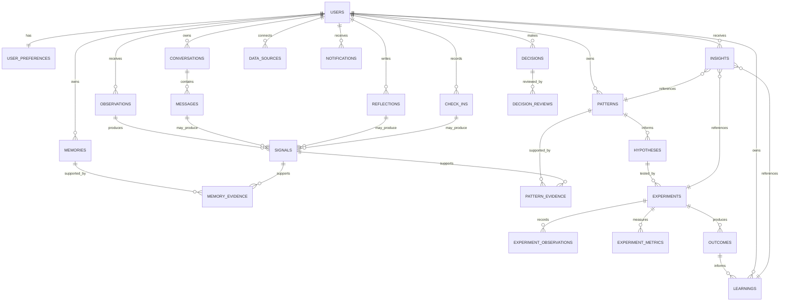
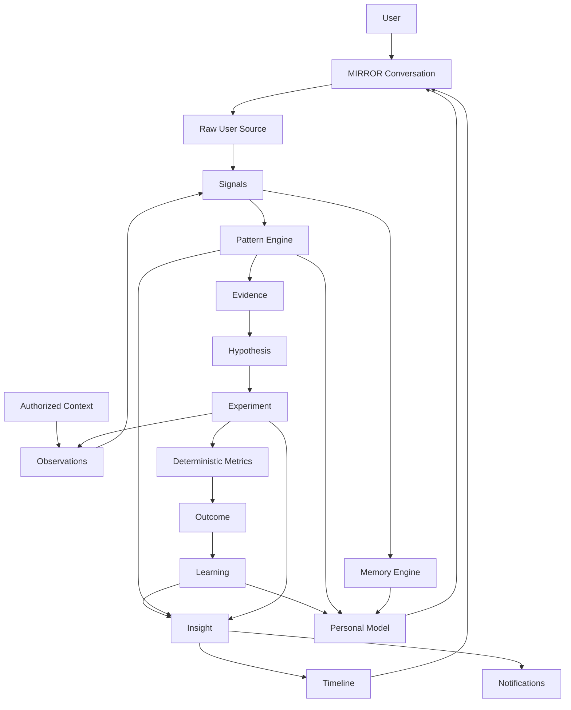

# Aks / MIRROR — Master Product, UX, AI, Architecture & SRS Specification

**Document status:** Consolidated master source of truth  
**Product:** Aks.ai  
**Core interface:** MIRROR  
**Primary tagline:** **Understand yourself, differently.**  
**Secondary positioning:** **A personal behavioral laboratory.**  
**Target platform:** iOS + Android  
**Frontend:** React Native + Expo + TypeScript  
**Backend/data:** Supabase + PostgreSQL  
**AI architecture:** MirrorCore → provider-neutral AI Service → provider adapter  
**Billing:** RevenueCat  
**Document purpose:** Turn the complete Aks/MIRROR Markdown corpus into one coherent, implementation-ready product specification without changing the original product thesis.

---

## 0. Source of Truth and Consolidation Rules

This document consolidates the following project materials:

1. `features.md`
2. `additional.md`
3. `Aks_Complete_Product_Report_SRS(2).md`
4. `concept(1).md`
5. `concept1(1).md`
6. `conceptual_phase(1).md`
7. `connect_provider(1).md`
8. `observation(1).md`
9. `retention(1).md`

### 0.1 Fidelity rule

The product thesis, terminology, architecture boundaries, privacy philosophy, feature set, UX direction, and behavioral loop in the source documents are treated as canonical project intent.

The purpose of consolidation is to:

- remove duplication;
- improve consistency;
- clarify responsibilities;
- make behavior deterministic;
- specify how features work end-to-end;
- distinguish shipped/core behavior from progressive or platform-dependent features;
- prevent unsupported assumptions from becoming requirements.

### 0.2 Conflict-resolution rule

When the source files contain overlapping decisions, the consolidated rule is:

1. preserve the strongest/latest explicit architectural decision;
2. preserve all distinct features even when they have different maturity levels;
3. do not create a competing service when an existing service is named;
4. do not convert an example into a requirement;
5. when a capability depends on platform/provider configuration, label it `SUPPORTED WITH PLATFORM CONDITIONS` or `FUTURE` rather than pretending it is universally available;
6. when implementation status is unknown, label it `REQUIRES REPOSITORY VERIFICATION`.

### 0.3 Non-fabrication rule

No implementation may claim completion unless the complete path exists:

`UI → domain/service → backend/integration → persistence → real result`

A visual placeholder that behaves as if a backend capability exists is explicitly prohibited.

---

# 1. Executive Product Definition

## 1.1 What Aks is

Aks is a personal behavioral understanding system whose central interface is **MIRROR**.

MIRROR helps a person:

- think aloud;
- reflect in text or voice;
- preserve what actually happened;
- structure observations;
- notice repeated patterns;
- question those patterns;
- form testable hypotheses;
- run personal experiments;
- measure outcomes from real observations;
- turn evidence into reusable learnings;
- surface selective insights at the right time;
- revisit the evolving story through Timeline;
- understand what Aks remembers and why.

Aks is not primarily a diary, habit tracker, productivity dashboard, therapist, or generic chatbot.

The product is designed as a **personal behavioral laboratory**.

## 1.2 Product thesis

> **MIRROR helps you discover behavioral patterns, turn them into testable hypotheses, and learn what actually changes your outcomes.**

## 1.3 Core promise

Aks does not tell users who they should become.

It helps them understand:

- what they actually do;
- what repeats;
- what changes;
- where assumptions conflict with evidence;
- what relationships might be worth exploring;
- which interventions have been tested;
- what the results actually showed;
- what has been learned so far.

## 1.4 Signature capability

The product has two connected signature experiences:

### Discovery

**What don't I know about myself?**

Aks searches for sufficiently supported, not-yet-rejected patterns that have not already been surfaced repeatedly.

### Learning

**What actually changes me?**

Aks progressively builds a history of personal experiments and their outcomes so future suggestions can be grounded in the user's own evidence rather than generic advice.

## 1.5 Product moat

The moat is not the LLM itself.

The moat is the longitudinal personal experimentation graph:

```text
                    USER
                      │
            ┌─────────┴─────────┐
            ↓                   ↓
         BEHAVIOR            CONTEXT
            │                   │
            └─────────┬─────────┘
                      ↓
                   PATTERN
                      ↓
                  HYPOTHESIS
                      ↓
                  INTERVENTION
                      ↓
                    RESULT
                      ↓
                   LEARNING
                      ↓
              PERSONAL MODEL
                      │
                      └─────────────→ NEXT TEST
```

---

# 2. Product Principles

These are architectural and behavioral constraints, not marketing slogans.

## 2.1 Reflection over performance

The product measures understanding, not user worth or productivity.

No user should feel that they failed because they:

- missed a check-in;
- stopped an experiment;
- did not open the app;
- wrote less;
- did not maintain a streak.

## 2.2 Evidence before insight

Aks must prefer evidence-backed statements over labels.

Bad:

> “You are bad at finishing things.”

Better:

> “7 of your last 10 projects changed scope before completion.”

Better still when appropriate:

> “Scope changes appear associated with lower completion in your recent projects.”

## 2.3 Uncertainty must be visible

Inferred behavioral claims should carry enough context for the user to understand their strength.

Where relevant, expose:

- confidence language;
- evidence count;
- timeframe;
- source types;
- alternative explanations;
- whether the relationship has been experimentally tested.

Do not expose internal model scores when they would confuse the user. A technical confidence value and a user-facing confidence label are different concerns.

## 2.4 Correlation is not causation

The default language is:

- appears associated;
- may be related;
- might contribute;
- possible pattern;
- worth exploring;
- evidence suggests.

Avoid causal language unless the evidence actually justifies it.

Experiments provide stronger evidence, but even an N-of-1 experiment should not be presented as universal scientific proof.

## 2.5 AI is not the source of truth

The source of truth is:

- structured domain data;
- deterministic calculations;
- validated evidence links;
- explicit user input;
- actual source observations;
- domain lifecycle state.

LLMs interpret, summarize, explain, and propose. They do not own persistence, authorization, counts, timestamps, or user identity.

## 2.6 Human agency over automation

Aks may suggest a pattern, hypothesis, experiment, or interpretation.

The user remains able to:

- confirm;
- reject;
- correct;
- question;
- dismiss;
- investigate;
- test;
- forget a memory;
- disconnect a data source.

## 2.7 Useful memory, not total memory

Not every sentence becomes memory.

Memory exists only when it is useful, evidence-supported, and appropriate to carry forward.

## 2.8 Selective attention

Aks should not surface every interesting thing it can calculate.

An insight is valuable partly because it is timely and meaningful.

## 2.9 Privacy by design

The product may contain highly personal information.

Therefore:

- explicit consent;
- source-level permissions;
- data minimization;
- user controls;
- traceability;
- secure transport/storage;
- source-specific deletion;
- account deletion;
- honest platform capability reporting

are foundational product requirements.

## 2.10 Provider independence

No product domain rule may depend on one AI vendor.

Provider-specific code belongs behind the AI Provider Adapter.

---

# 3. What Aks Is Not

Aks is not:

- a generic ChatGPT clone;
- a generic journal;
- a habit streak product;
- a gamified productivity tracker;
- a vanity analytics dashboard;
- an “all-seeing” surveillance application;
- a medical diagnostic system;
- a therapy replacement;
- a social network;
- a workplace monitoring system;
- a personality profiler for other people;
- a fake tool-using assistant that claims to have searched or observed something when it did not.

Explicitly rejected foundation features include:

- streaks;
- badges;
- XP;
- rankings;
- guilt-based notifications;
- unnecessary engagement manipulation;
- hidden monitoring;
- generic prompt-chip libraries unrelated to Aks;
- fake weather/search/calendar claims;
- cross-user profiling.

---

# 4. Core Product Loop

The canonical Aks loop is:

```text
Observe
   ↓
Structure
   ↓
Detect Pattern
   ↓
Validate
   ↓
Hypothesis
   ↓
Experiment
   ↓
Measure
   ↓
Learn
   ↓
Observe again
```

Operationally:

```text
Conversation / Reflection / Check-in / Connected Context
                    ↓
                 Signals
                    ↓
               Observations
                    ↓
                 Memories
                    ↓
                 Patterns
                    ↓
               Hypotheses
                    ↓
               Experiments
                    ↓
              Observations
                    ↓
                Metrics
                    ↓
                 Outcome
                    ↓
                Learning
                    ↓
                 Insight
                    ↓
               Timeline / Mirror
                    ↓
                Next cycle
```

### Important distinction

`Memory`, `Pattern`, `Hypothesis`, `Experiment`, `Learning`, and `Insight` are not aliases for one another.

Each has its own evidence standard, lifecycle, UI meaning, and storage model.

---

# 5. Domain Ontology

## 5.1 Raw source / user words

The user's original words are immutable source material for the product layer unless the user explicitly edits/deletes the source record.

Examples:

- a reflection text;
- a user chat message;
- a final voice transcript;
- a check-in;
- an explicitly selected image/document;
- an explicit decision statement.

## 5.2 Observation

An observation records something objectively available from an authorized source.

Examples:

- calendar event scheduled 19:00–20:00;
- normalized travel window of 42 minutes;
- focus session of 36 minutes;
- app-usage aggregate for a defined period.

## 5.3 Signal

A signal is a small structured candidate fact derived from source records.

Examples:

- “focus difficulty mentioned”;
- “planned work session existed”;
- “high context switching observed”;
- “check-in: Good”.

Not every source record produces a signal.

## 5.4 Memory

A durable, selective piece of context that may be useful in future interactions.

Examples:

- “Works better with a clear next step.”
- “Prefers shorter first actions when a project feels ambiguous.”

A memory is not a transcript summary and not a diagnosis.

## 5.5 Pattern

A repeated relationship supported by multiple observations/signals.

Example:

> Scope changes appear associated with later project abandonment.

## 5.6 Hypothesis

A testable statement derived from a pattern or user exploration.

Example:

> Defining scope before starting may reduce project drift.

## 5.7 Experiment

A bounded N-of-1 intervention used to test a hypothesis.

An experiment has:

- hypothesis;
- intervention;
- baseline where available;
- duration;
- metrics;
- observations;
- outcome;
- interpretation;
- learning when justified.

## 5.8 Learning

An evidence-based personal conclusion that can be reused and revised.

## 5.9 Insight

A selective piece of understanding worth surfacing now.

An insight is not simply “a pattern with a card”.

## 5.10 Timeline event

A user-facing projection of a meaningful domain event.

Timeline is a projection, not the canonical source of domain truth.

---

# 6. User Experience Architecture

## 6.1 Main navigation decision

The canonical main pager is:

```text
Timeline  |  Mirror  |  You
```

Mirror is the centered/default page.

A floating `Reflect` action is available for quick capture.

**Experiments are not a permanent main navigation tab.** They are entered contextually from Mirror, patterns, insights, or through You.

This consolidates the conflicting earlier four-tab concept with the later decision that Experiments should emerge from the behavioral loop rather than compete with Mirror.

## 6.2 Root tree

```text
ROOT
│
├── Splash
├── Onboarding
├── Auth
│   ├── Login
│   ├── Register
│   ├── Terms
│   └── Privacy Policy
│
├── Legal Acceptance
│
└── Main Pager
    │
    ├── Timeline
    │
    ├── Mirror
    │   ├── Conversation
    │   ├── Insight
    │   ├── Evidence
    │   ├── Pattern
    │   ├── Hypothesis
    │   └── Experiment
    │
    └── You
        ├── You Home
        ├── Patterns
        ├── Experiments
        ├── Learnings
        ├── Decisions
        ├── Personal Model
        ├── Your Data
        ├── Notifications
        ├── Appearance
        ├── Privacy
        ├── Help & Feedback
        └── Settings
```

## 6.3 Screen/state inventory

The product contains many user-facing states, but these must not become 68 unrelated components. States should be implemented as variants, bottom sheets, nested routes, contextual detail surfaces, or reusable components where appropriate.

### Authentication

1. Splash
2. Welcome
3. Sign in
4. Apple authentication
5. Google authentication
6. Email magic link
7. Authentication verification
8. Account recovery
9. Session expired

### Onboarding

10. Welcome to MIRROR
11. Goal selection
12. First reflection
13. Permission introduction
14. Baseline generation
15. First insight
16. Notification permission
17. Completion

### Mirror

18. Mirror Home
19. Insight Detail
20. Evidence View / Evidence Drawer
21. Pattern Detail / Pattern Conversation
22. Hypotheses Inbox
23. Contradictions
24. Ask MIRROR
25. Ask MIRROR Answer
26. What Don’t I Know?
27. Conversation History
28. Current Conversation Search

### Timeline

29. Timeline
30. Day View
31. Event Detail
32. Activity Detail
33. Timeline Filter
34. Weekly Story / Reflection
35. What Changed?

### Reflection

36. Reflect
37. Voice Recording
38. Processing
39. Extraction Review
40. Edit Reflection
41. Saved Reflection
42. Daily Check-in

### Experiments

43. Experiments Home
44. Experiment Proposal
45. Experiment Setup
46. Baseline
47. Active Experiment
48. Daily Check-in
49. Experiment Result
50. Learning
51. Experiment History

### Personal Model / Decisions

52. You
53. Personal Model
54. Patterns Library
55. Hypotheses Inbox
56. Decisions
57. Decision Creation
58. Decision Review
59. Contradictions
60. Learnings

### Data / Privacy / Account

61. Your Data
62. Data Sources
63. Source Detail / Permission State
64. Data Usage
65. Data Access
66. Export Data
67. Delete Data / Delete Account
68. Notifications
69. Appearance
70. Privacy Policy
71. Help & Feedback Home
72. FAQ
73. Report Problem
74. Send Feedback
75. Settings
76. Profile
77. Subscription / Paywall
78. RevenueCat Customer Center / Restore Purchases
79. About
80. Account

---

# 7. Launch, Onboarding and Authentication

## 7.1 Splash

Purpose:

- restore local state;
- restore authentication/session state;
- decide routing;
- avoid flashing the wrong screen.

Visual requirements:

- Aks/MIRROR identity;
- short branded motion;
- no buttons;
- no long loading sequence.

Routing decision:

```text
Splash
  ↓
App State Check
  ├── first-time → Onboarding
  ├── unauthenticated → Auth
  ├── authenticated + legal acceptance required → Legal Acceptance
  └── authenticated + ready → Main
```

## 7.2 Welcome

Canonical tone:

```text
Meet your Mirror.

You live your life.
I’ll pay attention to the patterns.

[ Get Started ]
```

Alternative onboarding sequence from the source corpus may use:

```text
YOUR LIFE LEAVES CLUES

Don't just reflect.
Test it.

A clearer you.
```

These are compatible copies for the same onboarding purpose, not separate product concepts.

## 7.3 Personalize

Ask:

> What would you like to understand better?

Possible options:

- My focus
- My time
- My habits
- My decisions
- My work
- Something else

Do not make the user fill a long profile before they experience value.

## 7.4 First reflection

Invite the user to share something they have noticed about themselves.

Input methods:

- text;
- voice.

Do not require taxonomy selection before the user can speak naturally.

## 7.5 Baseline generation

Aks may show a subtle building state as it creates a baseline from actual source records.

Never invent the baseline simply to create a “magic moment”.

## 7.6 First insight

The first insight must be backed by real available evidence.

Example structure:

```text
YOUR FIRST PATTERN

You don't seem to struggle with starting.
You struggle with continuing after the first obstacle.

Based on:
8 projects
6 weeks
14 recorded interruptions

Confidence: Moderate

[ Why do you think? ]
[ That’s accurate ]
[ Not really ]
```

If insufficient evidence exists:

> Your Mirror is still learning.

Do not create a fake first insight.

## 7.7 Authentication

Supported source decisions:

- Apple Sign In;
- Google Sign In;
- email magic link;
- account recovery where needed;
- session management.

The shared Supabase Auth system remains the authentication source of truth.

No duplicate authentication system.

## 7.8 Legal acceptance

Required acceptance is explicit and server-stamped.

Routes:

- Terms;
- Privacy Policy;
- acceptance state.

A local checkbox is not the authority for legal acceptance.

---

# 8. MIRROR — Primary Experience

## 8.1 Role of Mirror

Mirror is the front door to the entire behavioral system.

It is where the user can:

- think aloud;
- type;
- speak;
- check in;
- ask questions;
- inspect a pattern;
- challenge an interpretation;
- start an experiment;
- discover what Aks remembers;
- ask why Aks thinks something;
- move naturally into deeper product surfaces.

Mirror should not feel like a generic prompt/response chatbot.

## 8.2 Mirror Home

The home screen should feel like a daily behavioral briefing, not a dashboard.

Example:

```text
Good morning.

Here’s what your behavior
has been telling us.

────────────────────────

YOUR PATTERN

You protect your mornings
better than your evenings.

[ See evidence ]

────────────────────────

SOMETHING CHANGED

Your uninterrupted work
increased this week.

[ What changed? ]

────────────────────────

WORTH TESTING

You may lose momentum
when tasks become ambiguous.

[ Try it ]

────────────────────────

Ask Mirror

“Why am I not finishing
my projects?”

🎙 / keyboard
```

When nothing meaningful is detected:

> Nothing unusual today.

Followed by a lightweight check-in or reflection entry point.

Do not manufacture novelty.

## 8.3 Daily check-in

Core quick check-in values in the source corpus include:

- Good;
- Okay;
- Chaos.

Structured check-in records may also include fields such as:

- mood;
- energy;
- focus;
- stress;
- notes.

The UI should remain small and conversational.

## 8.4 Mirror composer

The composer remains compact.

Canonical interaction:

- left side: keyboard/input affordance when appropriate;
- center X: closes composer/clears draft state without deleting conversation;
- right action/menu: New conversation, Conversation history, contextual actions;
- empty text → microphone available;
- text present → Send.

Keyboard opening focuses the input.

Closing the composer does not delete the conversation.

## 8.5 Natural conversation

Example:

```text
You:
I couldn’t focus today.

Mirror:
I noticed something similar last Thursday.

You had 4 interruptions before your first focused session.

Do you think that’s what happened today too?

[ Yes ] [ Maybe ] [ No ]
```

The assistant may pull relevant context only when authorized and useful.

---

# 9. Conversation System

## 9.1 Conversation as first-class data

Use the existing:

- `conversations` table;
- `messages` table.

Do not create a second conversation store.

Users can:

- see previous conversations;
- search conversations;
- open conversations;
- rename conversations;
- archive conversations;
- delete conversations;
- start a new conversation.

Conversation list displays only useful metadata:

- title;
- short preview;
- relative/actual date;
- optional subtle status.

## 9.2 Conversation title

Automatic titles are allowed only when derived from real conversation content.

Do not generate fake titles.

Avoid generic defaults such as:

- New Chat;
- Conversation 1;
- Chat with Aks.

If there is insufficient context, use the simplest honest fallback.

## 9.3 Conversation search

Search targets:

- title;
- message content.

Requirements:

- fast;
- text-first;
- authenticated/user-scoped;
- server-side searchable at scale.

Do not download the entire conversation database simply to search locally.

Empty state:

> No conversations found.

No fabricated suggestions.

## 9.4 Current conversation search

Search within the open conversation when useful.

Only matching message content is surfaced.

Do not unnecessarily load the full historical conversation into memory.

## 9.5 Message actions

Contextual menu / long press rather than always-visible action bars.

Actions:

- Copy;
- Share;
- Retry / Try again where valid;
- Edit user message where valid;
- Feedback where useful;
- Report response.

## 9.6 Edit user message

Behavior:

```text
Edit
 ↓
message becomes editable
 ↓
user changes content
 ↓
submit
 ↓
new assistant response from edited turn
```

The system must use one deterministic strategy:

- branch from the edited message, or
- replace the current turn and regenerate subsequent assistant output.

The implementation must not produce duplicate assistant responses.

Historical context must not become confusing because of silent mutation.

## 9.7 Regenerate response

UI copy:

> Try again

Requirements:

- same user turn;
- no duplicated user message;
- one consistent visible assistant version;
- real AI request must succeed before claiming regeneration;
- failed regeneration must remain visibly failed rather than appearing successful.

## 9.8 Copy

Use native clipboard APIs.

Confirmation:

> Copied

No modal dialog.

## 9.9 Share

Use the native share sheet.

Share only user-visible content and optional explicitly intended context.

Never share:

- hidden metadata;
- internal prompts;
- system instructions;
- provider information;
- private internal IDs;
- hidden telemetry.

## 9.10 Draft persistence

Preserve an unsent draft locally where practical.

Rules:

- no unnecessary remote persistence of sensitive drafts;
- clear when explicitly sent or discarded;
- safe local storage only.

## 9.11 Smart scrolling

During streaming:

- auto-scroll only when user is already near bottom;
- if the user scrolls upward, stop forcing the list downward;
- show `Jump to latest` when new messages appear below the viewport.

## 9.12 Long responses

Text:

- readable paragraphs;
- short lists where useful;
- limited formatting;
- no giant walls of text.

Voice:

- naturally conversational length;
- user can interrupt;
- very long responses should not automatically become long uninterrupted audio.

## 9.13 Formatting

Support:

- paragraphs;
- emphasis;
- short lists;
- simple headings where useful.

Do not over-format every response.

Voice playback must not read Markdown syntax literally.

---

# 10. Multimodal Conversation

## 10.1 Single conversation model

Text, voice, images, and supported documents belong to the same conversation.

Do not create separate “voice conversations”, “image conversations”, or “document conversations”.

## 10.2 Image input

User explicitly chooses:

- Camera;
- Photo Library.

Examples:

- screenshot;
- photo;
- document image;
- visual reference.

Never upload an image without user action.

Do not permanently retain images unless the product has a real need for them.

## 10.3 Attachment preview

Before send:

- show compact preview;
- remove attachment;
- replace attachment.

Avoid giant composers.

Avoid uploading before necessary when the chosen architecture can defer upload until send.

## 10.4 Document input

Supported categories may include:

- PDF;
- supported text document;
- image.

Pipeline:

```text
File
 ↓
Secure upload
 ↓
Extraction
 ↓
Normalization
 ↓
Relevant context selection
 ↓
AI task
 ↓
Validated result
```

Do not:

- send giant documents blindly to the model;
- expose raw storage paths to the model;
- expose storage bucket internals to the UI.

## 10.5 Provider-agnostic document layer

Document ingestion is a domain capability, not an AI-provider-specific implementation.

---

# 11. Voice and Realtime Conversation

## 11.1 Voice mode

Voice is explicit user interaction.

Outside active voice mode:

- microphone OFF;
- no ambient listening;
- no passive background recording.

## 11.2 Voice state machine

```text
Idle
 ↓
Starting
 ↓
Listening
 ↓
Understanding / Streaming
 ↓
Speaking
 ↓
Idle
```

Failure states:

```text
Starting → Error
Listening → Reconnecting
Speaking → Interrupted
Session → Ended
```

## 11.3 Controls

Where supported:

- mute microphone;
- resume microphone;
- speaker/audio state;
- stop Aks speaking;
- reconnect;
- end session.

Mute means microphone input is stopped from being sent to the active realtime session.

Mute does not terminate the conversation.

## 11.4 Transcript control

Maintain two conceptual states:

- interim transcript;
- final transcript.

Interim transcript is transient.

Final transcript becomes a conversation message/source record according to the configured architecture.

Never duplicate interim and final transcripts as separate user messages.

Do not expose technical speech confidence values unless there is a clear user value.

## 11.5 Stop speaking

`Stop speaking` immediately stops playback without deleting the text response.

User can continue the conversation afterward.

## 11.6 Voice ↔ text continuity

Switching between voice and text must preserve conversation context.

Do not reset the context or create unnecessary duplicate sessions.

## 11.7 Session recovery

If the realtime session dies:

- preserve the conversation;
- preserve already-confirmed messages;
- allow reconnect;
- prevent duplicate messages;
- prevent replaying old audio;
- avoid duplicate sessions.

## 11.8 Lifecycle cleanup

Resources must be cleaned up correctly when:

- app enters background;
- screen loses focus;
- screen unmounts;
- user logs out;
- account changes;
- account is deleted.

---

# 12. Reflection System

## 12.1 Reflect entry point

Floating action:

```text
🎙
Reflect
```

Prompt:

> What’s on your mind?

Modes:

- voice;
- text.

Optional reflection intents from the source UX:

- Something happened;
- Something changed;
- I learned something;
- I made a decision;
- I noticed a pattern.

These are optional semantic shortcuts, not required classification.

## 12.2 Save raw first

A reflection is stored in its original form before AI extraction.

The raw source must never be overwritten by the extraction result.

## 12.3 Processing flow

```text
User reflection
 ↓
Persist raw source
 ↓
AI extraction task
 ↓
Validate structured extraction
 ↓
Show extraction review when needed
 ↓
User corrects/accepts
 ↓
Persist structured result
 ↓
Generate candidate signals
 ↓
Timeline projection
```

## 12.4 Extraction review

Example:

```text
I heard:

“I had planned to code for two hours
but ended up researching competitors.”

MIRROR extracted

Activity       Research
Planned        Coding
Duration       ~2 hours
Possible       Task drift

[ Save ] [ Correct ]
```

This makes extraction transparent.

## 12.5 Never silently overwrite user meaning

If Aks misinterprets a reflection, the user can correct it.

Corrections are domain evidence and may influence future interpretation, but do not retroactively alter the user's original words.

---

# 13. Signals

Signals are the small structured bridge between raw source material and higher-level engines.

Sources may include:

- conversation turns;
- reflections;
- check-ins;
- validated observations from connected sources;
- experiment observations;
- decision entries.

Examples:

```text
check-in: Good
focus difficulty mentioned
planned_work exists
travel context observed
high task switching observed
```

The signal system must:

- validate source ownership;
- avoid duplicates;
- preserve source references;
- preserve observed time;
- preserve enough context for evidence traceability.

A signal is not automatically a pattern.

---

# 14. Memory Engine

## 14.1 Purpose

Memory is Aks’s selective persistence layer for useful user context.

## 14.2 What can become memory

A memory may be derived when information is:

- useful beyond the current conversation;
- sufficiently supported;
- stable enough to carry forward;
- appropriate to remember.

## 14.3 Lifecycle

```text
candidate
  ↓
active
  ↓
revised / archived / rejected
```

Possible stored fields:

```text
id
user_id
memory_type
content
status
confidence
evidence_count
first_observed_at
last_observed_at
metadata
created_at
updated_at
```

## 14.4 Evidence

Memory evidence may reference:

- signal;
- message;
- reflection;
- check-in.

## 14.5 User control

Natural requests:

> What do you remember about me?

> Forget what I said about X.

> Forget that.

The system should identify an actual stored memory.

If ambiguous, ask for clarification inside the conversation.

Memory deletion is not the same thing as deleting the source conversation.

## 14.6 “What do you remember about me?”

Return a human-readable summary.

Do not expose raw database rows or internal IDs.

Never invent memories.

## 14.7 “Forget that”

Flow:

```text
User request
 ↓
Identify stored memory
 ↓
If ambiguous, confirm target
 ↓
Delete/archive through existing Memory system
 ↓
Preserve unrelated data
```

---

# 15. Pattern Engine

## 15.1 Purpose

Patterns identify repeated relationships across evidence.

## 15.2 Pattern types

From the source corpus:

- frequency;
- duration;
- trend;
- sequence;
- temporal;
- correlation;
- deviation;
- clustering;
- recurrence;
- completion;
- behavioral mismatch;
- anomaly detection;
- behavioral change.

## 15.3 Evidence threshold

A pattern should not be promoted based on a single event.

The earlier Aks architecture defines repeated evidence, with a practical baseline of 3+ occurrences before proposing a pattern. The exact threshold may be configurable by pattern type, but it must be explicit and reproducible.

## 15.4 Lifecycle

Canonical statuses may be represented as:

```text
candidate
possible
forming
interesting
testing
supported
not_supported
learned
archived
```

The final implementation should normalize these into one canonical enum rather than creating multiple overlapping state systems.

## 15.5 Pattern feedback

User options:

- This feels accurate;
- Not really;
- Not sure.

User feedback is evidence.

It is not unquestionable truth and should not automatically force confirmation.

## 15.6 Pattern detail

A pattern detail should show:

```text
WHAT AKS NOTICED

EVIDENCE

INTERPRETATION

UNCERTAINTY

WHAT DO YOU THINK?

[ This feels true ]
[ I’m not sure ]
[ Not really ]

[ Test this pattern ]
```

## 15.7 Evidence model

Every important pattern stores:

- source references;
- event/signal IDs;
- timeframe;
- calculations;
- confidence;
- model version;
- generation timestamp.

This is required for reproducibility.

---

# 16. “Why?” and Evidence Transparency

## 16.1 Why view

The user should be able to ask:

> Why do you think that?

This may open as a bottom sheet rather than a separate dashboard.

Example:

```text
Why do I think this?

Observed
12 morning sessions

Average
87 min uninterrupted

Compared with
43 min after 6 PM

Repeated
9 of the last 12 days

Sources
Focus sessions
App activity
Reflections
```

## 16.2 Evidence chain

Canonical chain:

```text
Insight
  ↓
Learning / Pattern
  ↓
Evidence
  ↓
Signal
  ↓
Observation
  ↓
Source
```

For conversation-only evidence:

```text
Answer
 ↓
Relevant user message/reflection/check-in
```

## 16.3 User-facing explanation

Use product-level reasoning, not hidden chain-of-thought.

Good:

> “I’m basing this on six similar situations you described over the last two weeks.”

Good with connected sources:

> “You connected your calendar and location, and those sources showed…”

Never expose:

- private prompts;
- chain-of-thought;
- provider secrets;
- internal tool names;
- hidden telemetry.

---

# 17. “What Do You Mean?” Exploration

Aks should support conversational drilling into an interpretation.

Example:

```text
You:
Why do I keep switching?

Mirror:
You often switch when the next step isn't clear.

That happened 6 times recently.

[ Show me ]
```

Then show real evidence:

```text
Monday

Started:
Build onboarding

12 min later:
Slack

9 min later:
Browser

15 min later:
YouTube

Then:
stopped
```

Every example must come from actual evidence.

---

# 18. “What Changed?”

This experience compares a current window with a user's historical baseline.

Example:

```text
I compared today with your usual days.

Today:
72m focus

Usually:
38m

Biggest difference:
No meetings between 9 and 11.

Interesting.

[ Try protecting this time ]
```

Requirements:

- actual baseline calculation;
- actual comparison window;
- deterministic numbers;
- explanation of the comparison;
- no invented cause.

---

# 19. “What Don’t I Know About Myself?”

## 19.1 Purpose

This is a signature discovery surface directly accessible from Mirror.

## 19.2 Selection logic

Candidate pattern ranking should favor patterns that are:

- sufficiently evidenced;
- not already rejected;
- not already over-surfaced;
- meaningfully distinct;
- potentially actionable or illuminating;
- supported by a valid evidence chain.

## 19.3 Example

```text
I found 3 things
you haven’t noticed yet.

01
You tend to lose momentum
after scope changes.

02
Your strongest work sessions
share a similar preparation ritual.

03
You underestimate transition
cost between unrelated tasks.
```

The experience should open conversationally rather than dumping a data report.

---

# 20. Contradiction Engine

Aks may detect a mismatch between:

- what the user says;
- what structured data shows;
- what previous decisions predicted;
- what current behavior suggests.

Example:

```text
Something doesn’t quite match.

You often say:
“I don’t have enough time.”

Recent data:
Free time       18h
Focused work     7h
Context switching 11h

So maybe time itself
isn’t your biggest problem.

[ Investigate ]
[ Not really ]
```

Rules:

- do not accuse;
- do not moralize;
- do not state motive as fact;
- explain which sources created the contradiction;
- let the user challenge the interpretation.

---

# 21. Decision System

## 21.1 Decision entry

Decisions are recorded conversationally.

Example:

```text
You:
I have to decide whether
to continue this project.

Mirror:
Okay.

What matters most here?

[ Money ]
[ Learning ]
[ Time ]
[ Growth ]
[ Peace of mind ]
```

MIRROR asks only what is needed.

No large form.

## 21.2 Decision model

A decision can retain:

- decision statement;
- decision context;
- chosen option;
- expected outcomes;
- importance dimensions;
- date;
- evidence used.

## 21.3 Decision review

Weeks later:

```text
You made this decision
6 weeks ago.

You expected:
Learning     High
Revenue      Medium
Time cost    Low

Actual:
Learning     High
Revenue      Low
Time cost    High

Would you like me to
remember this pattern?
```

This creates a **decision calibration** loop.

The system should learn from actual outcomes without implying infallible prediction.

---

# 22. Experiment Engine

## 22.1 Core concept

Experiments are not habits or streaks.

They are bounded tests of a behavioral hypothesis.

## 22.2 Experiment lifecycle

```text
Draft
 ↓
Active
 ↓
Completed
```

Alternative exit:

```text
Draft / Active
 ↓
Cancelled
```

## 22.3 Trigger

Typical flow:

```text
Pattern / Insight
 ↓
Test this
 ↓
Hypothesis
 ↓
Experiment proposal
 ↓
Start
```

## 22.4 Experiment proposal

Example:

```text
I think this is worth testing.

For the next 7 days:
Before starting work,
decide the ONE next action.

That’s it.

I’ll watch what changes.

[ Start experiment ]
[ Not now ]
```

## 22.5 Experiment setup

Required concepts:

- hypothesis;
- intervention;
- duration;
- baseline;
- outcome metrics;
- optional comparison window.

Example:

```text
Hypothesis
I focus better when mornings are slower.

Change
Avoid meetings before 10 AM.

Duration
7 days

Outcome to watch
Focus
```

## 22.6 “MIRROR tracks the experiment for the user”

The experiment experience should minimize manual tracking.

Where reliable observations exist, Aks uses them automatically.

Manual input remains available when needed.

## 22.7 Active experiment

Keep the check-in small.

Example:

```text
Morning routine

Day 4 of 7

Focus
Low ─────●──── High

Energy
Low ─────●──── High

🎙 Tell me more
```

## 22.8 Missing observation behavior

Never shame.

Do not say:

> You missed today.

Prefer:

> No check-in recorded today.

Missingness is itself a data condition, not failure.

## 22.9 Experiment observations

Each observation should be:

- timestamped;
- experiment-owned;
- idempotent where applicable;
- structured where possible;
- linked to the source when derived from connected context.

## 22.10 Deterministic metrics

Metrics are computed from actual observations.

Do not allow the LLM to invent numbers.

Example:

```text
Baseline focus: 23m
Final/period focus: 36m
Change: +13m
Percent change: +56.5%
```

The system may round presentation values, but calculation should remain deterministic.

## 22.11 Experiment completion

Example:

```text
Experiment complete.

Focus
23m → 36m

Switching
4.8 → 3.1

What do you think?

[ It helped ]
[ It didn’t help ]
[ Not sure ]
```

## 22.12 Honest result language

Good:

> The experiment suggests slower mornings may have helped your focus.

Avoid:

> Slower mornings cause better focus.

unless evidence genuinely supports stronger language.

---

# 23. Learning Engine

## 23.1 Purpose

Learning is the durable result of evidence, particularly experiments and repeated observations.

## 23.2 Learning lifecycle

```text
Active
 ↓
Revised
 ↓
Archived
```

A learning may be revised when later evidence adds nuance or contradicts it.

## 23.3 Learning detail

Show:

- original hypothesis;
- experiment;
- evidence;
- outcome;
- user interpretation;
- date learned;
- confidence language;
- revision history where useful.

## 23.4 Conversational learning save

When the user taps “Keep this learning”:

```text
I’ll remember this.

You seem to work better when
your next action is clear.

I’ll use this when I notice
similar situations.

[ Got it ]
```

Do not make the user learn internal terminology such as “Create Pattern”.

---

# 24. Insight Engine

## 24.1 Definition

An insight is a meaningful piece of understanding worth surfacing now.

It may reference:

- pattern;
- learning;
- experiment;
- decision;
- relevant evidence.

## 24.2 Insight lifecycle

```text
new
 ↓
seen
 ↓
dismissed / archived
```

## 24.3 Insight generation

AI may propose an insight candidate.

Insight Service must then:

1. validate referenced objects;
2. verify ownership;
3. verify evidence exists;
4. verify evidence is sufficiently fresh/relevant;
5. check duplicate/similar insight history;
6. check user preferences;
7. persist only a legitimate candidate.

## 24.4 Insight feedback

Possible feedback:

- Helpful;
- Not useful.

No stars.

No 1–10 ratings.

No gamification.

Feedback is a calibration signal only.

---

# 25. Personal Model

The Personal Model is the long-term representation of what Aks has learned from the user's own history.

Conceptually:

```text
USER
│
├── GOALS
├── PROJECTS
├── BEHAVIORS
├── DECISIONS
├── PATTERNS
├── HYPOTHESES
├── EXPERIMENTS
└── LEARNINGS
```

The model should eventually help answer:

- What tends to happen?
- What appears associated with it?
- What intervention has been tested?
- What did not change anything?
- How strong is the evidence?

The Personal Model is not a static personality profile.

---

# 26. Timeline

## 26.1 Purpose

Timeline answers:

> What actually happened?

It is not:

- a spreadsheet;
- an analytics dashboard;
- an exhaustive database browser;
- one row per chat message.

## 26.2 Projection model

Timeline is a projection of meaningful events:

- reflection;
- check-in;
- insight;
- pattern;
- experiment started;
- experiment outcome;
- learning;
- decision;
- meaningful conversation event.

## 26.3 Filters

Canonical filters:

- All;
- Insights;
- Experiments;
- Check-ins;
- Decisions.

Additional activity detail may exist when genuinely useful.

## 26.4 Grouping

```text
TODAY
YESTERDAY
THIS WEEK
OLDER
```

## 26.5 Day View

A vertical timeline can show:

```text
7 AM
  ● wake/context
  ● phone/context
  ● breakfast
  ● deep work
  ● Slack
  ● coding
  ● meeting
  ● gym
  ● project work
  ● late browsing
11 PM
```

Only show data that is actually available from the user's enabled sources.

## 26.6 Weekly story mode

Triggered from Timeline or weekly notification.

Example:

```text
Your week with Aks

You showed up most often
on days with structured mornings.

You tested:
Morning routine

You learned:
Less early friction helped you begin faster.

What changed?
```

Do not fabricate a narrative if the evidence is insufficient.

---

# 27. Ask MIRROR

## 27.1 Purpose

Natural-language questioning over the user's authorized personal model.

Examples:

- Why am I not finishing things?
- What changed this month?
- When am I most focused?
- What keeps distracting me?
- What do you remember about me?
- Why do you think that?
- What data are you using right now?
- What can Aks access?

## 27.2 Query pipeline

```text
User question
 ↓
Intent classification
 ↓
ContextResolver
 ↓
Relevant conversation context
 ↓
Relevant signals
 ↓
Relevant observations
 ↓
Relevant memories
 ↓
Relevant patterns
 ↓
Active experiments
 ↓
Evidence ranking
 ↓
Reasoning task
 ↓
Validated response
 ↓
Optional linked evidence/detail
```

## 27.3 Bounded context

Never send the entire personal history to the model.

Use only the minimum relevant context within a bounded time and domain window.

## 27.4 Unsupported questions

When the data is insufficient:

> I don’t have enough evidence to say that yet.

Then describe what Aks does have, if useful.

---

# 28. AI Core — MirrorCore

## 28.1 Architectural role

MirrorCore is the central application-level intelligence orchestrator.

It coordinates:

- conversation processing;
- context selection;
- AI task routing;
- structured extraction;
- domain service handoffs;
- validation;
- persistence orchestration;
- evidence linking;
- user-facing status.

MirrorCore does **not** own:

- provider-specific SDK details;
- raw device APIs;
- database authorization policy;
- billing state;
- final source-of-truth calculations.

## 28.2 Request lifecycle

Canonical flow:

```text
User submits input
 ↓
Persist source with requestId / idempotency key
 ↓
Determine submission type
 ↓
Build bounded context
 ↓
Route to AI task through AI Service
 ↓
Validate structured response
 ↓
Persist assistant response
 ↓
Create candidate signals
 ↓
Dispatch domain processing
 ↓
Memory / Pattern / Experiment / Learning / Insight updates
 ↓
Timeline projection
 ↓
Optional notification eligibility
```

## 28.3 Provider-neutral AI Service

Interface concept:

```text
AIService.run(task, input, context)
```

Provider adapter owns:

- model identifier;
- SDK;
- endpoint;
- credentials;
- provider-specific request structure;
- provider-specific response transformation.

## 28.4 Separate AI responsibilities

Do not use one giant prompt for every task.

Use task-specific responsibilities:

```text
AI LAYER

Extraction
  ↓
Structured candidate data

Reasoning
  ↓
Interpretation / hypothesis candidates

Explanation
  ↓
User-facing evidence-aware language
```

Potential task types:

- signal extraction;
- reflection extraction;
- memory evaluation;
- pattern analysis;
- pattern explanation;
- hypothesis generation;
- experiment support;
- learning synthesis;
- insight generation;
- decision review explanation;
- conversational response generation.

## 28.5 Structured output first

AI should return structured JSON wherever possible.

The application validates:

- schema;
- field types;
- enum values;
- confidence range;
- referenced IDs;
- user ownership;
- evidence existence;
- duplicates;
- allowed lifecycle transitions.

Only then is data persisted.

---

# 29. AI Core Behavior Contract

This section turns the original Aks philosophy into explicit implementation behavior.

## 29.1 Rule: never invent personal facts

The model must not invent:

- user history;
- dates;
- counts;
- memories;
- patterns;
- experiments;
- outcomes;
- connected-source observations;
- permissions;
- tool execution;
- confidence values unsupported by the domain pipeline.

## 29.2 Rule: facts come from domain data

If a response says:

> “7 of your last 10 projects…”

then the count must come from deterministic application logic over real records.

The model receives the verified result; it does not invent or calculate the authoritative count from memory of a prompt.

## 29.3 Rule: evidence-aware language

The AI should select language based on evidence state:

```text
weak evidence
→ “I’m noticing a possibility…”

moderate evidence
→ “This appears to happen repeatedly…”

strong observational evidence
→ “This has appeared in 8 of your last 10 similar cases…”

experimental evidence
→ “In your experiment, this intervention was associated with…”
```

The final wording remains cautious and personal, never universal.

## 29.4 Rule: user words, source observations, inference are separate

The model prompt/context representation should preserve provenance labels such as:

```text
USER_SAID
SOURCE_OBSERVED
DERIVED_SIGNAL
PATTERN
MEMORY
HYPOTHESIS
EXPERIMENT_RESULT
LEARNING
```

Never flatten all of these into “context”.

## 29.5 Rule: do not infer motive casually

Avoid:

> “You procrastinated.”

Prefer:

> “Your departure was later than planned.”

> “That may have reduced your evening time.”

> “Worth exploring whether the disruption, rather than motivation, was the bigger factor.”

## 29.6 Rule: corrections update the model, not history

If the user says:

> “That wasn’t the reason.”

the model should update the relevant hypothesis/context/evidence state.

The original source record stays intact unless the user explicitly edits/deletes it.

## 29.7 Rule: user feedback is evidence, not absolute truth

Pattern feedback, insight feedback, and extraction corrections should influence future processing, but should not silently rewrite all historical conclusions.

## 29.8 Rule: no hidden memory claims

If a memory is not stored and retrievable, Aks cannot say it remembers it.

## 29.9 Rule: no fake tools

Aks must not say:

- “I checked the weather”;
- “I looked that up online”;
- “I checked your calendar”;
- “I searched your email”

unless the relevant real tool/source actually ran.

## 29.10 Rule: no raw provider/device access from AI

The AI provider never directly receives:

- GPS APIs;
- call-log APIs;
- contacts APIs;
- raw notification feeds;
- raw device activity APIs.

MirrorCore gets an approved context bundle from the ContextResolver.

## 29.11 Rule: sensitive context minimization

Even authorized data should not be retrieved if it is irrelevant to the current task.

## 29.12 Rule: no diagnosis

Aks remains a behavioral/self-reflection system.

It may discuss user-provided experiences and behavior, but should not diagnose medical or psychiatric conditions from the product's behavioral data.

---

# 30. ContextResolver and Context Bundles

## 30.1 Purpose

The ContextResolver determines what the AI actually needs for a response.

## 30.2 Context bundle

Conceptual structure:

```json
{
  "conversationContext": [],
  "relevantObservations": [],
  "relevantSignals": [],
  "memories": [],
  "patterns": [],
  "activeExperiments": [],
  "relevantLearnings": [],
  "relevantDecisions": []
}
```

## 30.3 Context selection example

User:

> “I couldn’t focus this afternoon.”

Potentially relevant:

- afternoon calendar context;
- relevant location change;
- recent focus observations;
- recent conversation evidence;
- active experiment.

Potentially irrelevant:

- unrelated location history from last month;
- unrelated old messages;
- unrelated contacts.

## 30.4 Context budget

Context retrieval must be bounded by:

- time window;
- source relevance;
- semantic relevance;
- task type;
- sensitivity.

## 30.5 User transparency

When useful:

> Based on this conversation.

> Based on something you shared earlier.

> Based on your active experiment.

With connected sources:

> I’m using your connected calendar and location context.

---

# 31. Safety and AI Failure Handling

## 31.1 AI unavailable

Never fabricate a response.

UI should show a truthful error state and allow retry.

## 31.2 Structured output invalid

Reject the invalid derived object.

Preserve the raw source.

Retry only within bounded policy.

## 31.3 Hallucinated evidence

If the model references an evidence item that does not exist:

- reject the unsupported reference;
- regenerate or fall back to a safe response;
- log the failure without leaking private content.

## 31.4 Prompt injection

Treat all user-provided and imported content as untrusted.

This includes:

- reflections;
- document text;
- images/OCR text;
- email content;
- external-source text;
- AI-generated intermediate text.

Imported text must not be allowed to override product-level policies.

## 31.5 Hidden chain-of-thought

Never expose hidden reasoning traces.

User-facing explanations are evidence summaries, not chain-of-thought.

## 31.6 Crisis/safety bypass

The original Aks architecture specifies that configured crisis-safety phrases bypass the general AI path and return a fixed supportive response.

That behavior should remain only if the relevant safety policy and product implementation are intentionally retained.

This is a safety response path, not a diagnosis engine.

---

# 32. Personal Context & Observation System

## 32.1 Purpose

Personal Context allows Aks to understand not only what the user says, but what the user explicitly authorizes Aks to observe from connected sources.

Core example:

```text
User:
“I planned to study today but somehow didn’t.”

Authorized context:
calendar → study event 19:00
location → away/travel context

Aks:
“You had planned to study around 7,
but you were still out then.
Do you think the issue was motivation,
or did the evening simply get disrupted?”
```

## 32.2 Architecture

```text
Device / External Source
        ↓
Permission Manager
        ↓
Source Adapter
        ↓
Context Normalizer
        ↓
Observation Store
        ↓
ContextResolver / MirrorCore
        ↓
Signal Engine
        ↓
Memory / Pattern / Experiment / Insight
```

Never read device data directly from MirrorScreen.

Never query device APIs directly from AI code.

Never allow the provider itself to access raw device APIs.

## 32.3 Core trust principle

Aks must distinguish:

1. what the user explicitly said;
2. what a source objectively observed;
3. what Aks inferred.

## 32.4 Source registry

Use one normalized `data_sources` architecture rather than one table per permission.

Potential source types from the corpus:

- location;
- calendar;
- reminders/tasks;
- screen time/device usage;
- contacts;
- calls;
- messages/SMS;
- notifications;
- photos;
- health/fitness;
- app activity;
- microphone/voice session;
- Google Calendar/Tasks;
- Todoist;
- Notion;
- GitHub;
- Slack;
- Email;
- other supported sources.

Only source types that are actually available and policy-compliant should be presented as available.

## 32.5 Source state model

```text
available
not_available
not_connected
permission_required
connected
temporarily_unavailable
revoked
error
```

Do not collapse all source state into a boolean.

## 32.6 Permission manager

Conceptual interface:

```text
PermissionManager.getStatus(source)
PermissionManager.request(source)
PermissionManager.revoke(source)
PermissionManager.openSettings(source)
```

## 32.7 Permission UX

Explain:

- WHAT;
- WHY;
- HOW IT HELPS;
- WHAT IS STORED;
- HOW TO STOP.

Do not ask for all permissions on first launch.

Do not create “Allow everything”.

## 32.8 Source control center

Route:

```text
You
 ↓
Your Data
 ↓
Connected Sources
```

Each source shows:

- purpose;
- status;
- permission state;
- last sync;
- manage;
- optional delete imported data.

Example:

```text
Location
Optional
Connected

Calendar
Optional
Connected

Calls
Unavailable on this device

Contacts
Not connected
```

## 32.9 Source-specific deletion

When implemented:

> Delete imported data

must delete only observations for that source.

It must not automatically delete:

- conversations;
- unrelated memories;
- unrelated patterns;
- unrelated experiments.

Derived-data deletion behavior must follow the defined provenance/deletion policy.

---

# 33. Supported and Conditional Personal Context Sources

## 33.1 Manual reflections

**Status:** CORE

Always available regardless of connected-source permissions.

## 33.2 Voice session

**Status:** CORE

Only active user-initiated voice sessions.

No passive microphone sensing.

## 33.3 Images

**Status:** CORE MULTIMODAL INPUT / IMPLEMENTATION DEPENDENT

Only user-selected images.

## 33.4 Documents

**Status:** IMPLEMENTATION DEPENDENT

Requires real document ingestion path.

## 33.5 Calendar

**Status:** PROGRESSIVE / OPTIONAL

Use only when authorized.

Prefer minimal fields:

- event title only when needed;
- start/end time;
- source/calendar identifier;
- relevant category.

Avoid unnecessary:

- attendees;
- descriptions;
- private notes;
- meeting links.

## 33.6 Tasks / reminders

**Status:** PROGRESSIVE / OPTIONAL

Use to compare:

`planned action` vs `observed outcome`.

Never infer task completion from absence of evidence.

Use:

> The planned gym session has no recorded completion.

not:

> You skipped the gym.

## 33.7 Location

**Status:** PROGRESSIVE / PLATFORM-CONDITIONAL

Potential modes:

- while using Aks;
- background observation where supported and explicitly authorized.

Default is OFF.

Prefer coarse meaningful observations such as:

- home area;
- work area;
- travel;
- unfamiliar place;
- stationary;
- moving.

Do not expose precise coordinates to the AI if coarse context is sufficient.

Do not store precise coordinates unless a concrete feature requires them and the user understands why.

## 33.8 Screen time / device usage

**Status:** PROGRESSIVE / PLATFORM-CONDITIONAL

Prefer aggregated windows:

- total usage duration;
- broad categories;
- meaningful time windows.

Avoid:

- every tap;
- every keystroke;
- every app event.

Observation:

> High social-app usage occurred between 21:00–22:00.

This may become a signal but is not automatic proof of distraction.

## 33.9 App activity

**Status:** PROGRESSIVE / PLATFORM-CONDITIONAL

Do not monitor every app unnecessarily.

Prefer aggregated observations.

## 33.10 Photos

**Status:** USER-SELECTED INPUT

Do not continuously scan the entire library.

Use the user's explicit selection.

## 33.11 Health / fitness

**Status:** FUTURE / STRICTLY OPTIONAL

Do not request health permissions merely to make Aks “smarter”.

Do not infer medical conditions.

Do not make health claims.

## 33.12 Contacts

**Status:** NOT A DEFAULT BEHAVIORAL SOURCE

Do not automatically import the entire address book.

Do not create a social graph.

Do not infer personality traits of contacts.

## 33.13 Calls

**Status:** RESTRICTED / PLATFORM-CONDITIONAL

Highly sensitive.

Do not:

- record call audio;
- intercept calls;
- monitor secretly;
- build fake call data;
- assume iOS/Android availability;
- implement `READ_CALL_LOG` merely for product intelligence.

If unavailable, represent the source honestly as unavailable.

If a compliant platform/API ever allows minimal metadata, use only what is genuinely necessary and authorized.

## 33.14 Messages / SMS

**Status:** RESTRICTED / GENERALLY NOT A DEFAULT SOURCE

Do not build generic SMS scraping.

Use explicit user-selected content if a future feature genuinely needs it and platform policy permits it.

## 33.15 Notifications

**Status:** RESTRICTED / OPTIONAL WHERE LEGITIMATE

Do not build a generic “read every notification forever” collector.

Prefer explicit source integrations.

## 33.16 OAuth integrations

Possible progressive integrations from the source corpus:

- Google Calendar;
- Google Tasks;
- Todoist;
- Notion;
- GitHub;
- Slack;
- Email.

These must be connector-specific, permissioned, and source-scoped.

---

# 34. Observation Model

Conceptual structure:

```ts
type Observation = {
  id: string;
  userId: string;
  sourceType: ObservationSourceType;
  observationType: string;
  observedAt: string;
  value: Record<string, unknown>;
  sourceEventId?: string;
  metadata?: Record<string, unknown>;
};
```

Example location observation:

```json
{
  "sourceType": "location",
  "observationType": "travel_window",
  "observedAt": "2026-09-18T18:30:00Z",
  "value": {
    "context": "travel",
    "durationMinutes": 42
  }
}
```

Example calendar observation:

```json
{
  "sourceType": "calendar",
  "observationType": "planned_activity",
  "observedAt": "2026-09-18T19:00:00Z",
  "value": {
    "eventCategory": "work",
    "scheduledDurationMinutes": 60
  }
}
```

Keep observation values structured enough for deterministic processing.

Do not create arbitrary opaque blobs for every source.

---

# 35. Raw vs Derived Data

Canonical chain:

```text
Raw source data
      ↓
Normalized observation
      ↓
Signal
      ↓
Pattern
      ↓
Hypothesis
      ↓
Experiment
      ↓
Outcome
      ↓
Learning
      ↓
Insight
```

Never skip directly from raw source data to an insight.

Every derived layer should preserve provenance.

---

# 36. Observation Engine

ObservationEngine responsibilities:

1. receive source observations;
2. validate source permission/state;
3. normalize the source data;
4. validate observation schema;
5. deduplicate;
6. store observations;
7. forward meaningful observations to Signal Engine;
8. respect retention and user controls.

ObservationEngine must **not** generate behavioral conclusions.

Pattern generation belongs to Pattern Engine.

---

# 37. Observation De-duplication

Device and provider sources often repeat events.

Deduplicate using a combination such as:

```text
source
+
stable source event identifier
+
observed timestamp
+
stable hash where needed
```

Repeated ingestion must not create duplicate signals or duplicate domain events.

---

# 38. Background Sync, Battery and Retention

## 38.1 Background sync

Use platform-supported bounded background execution.

Prefer:

```text
Periodic / event-driven sync
 ↓
collect permitted new data
 ↓
normalize
 ↓
upload only new observations
```

Do not create unrestricted continuous background jobs.

## 38.2 Battery

Avoid:

- continuous GPS polling;
- constant device scans;
- unnecessary wakeups;
- second-by-second collection.

If a source may materially affect battery, explain it before activation.

## 38.3 Retention philosophy

Default product philosophy is:

> Minimize raw data and retain useful derived understanding longer, subject to actual implemented deletion/retention policy.

Do not claim a retention period until it is implemented.

Potential cleanup model:

```text
Raw observation
 ↓
Processed / aggregated
 ↓
Safe cleanup where permitted
 ↓
Retained derived model
```

The exact retention job must be explicit in implementation and privacy documentation.

---

# 39. Personal Context User Commands

## 39.1 “What data are you using right now?”

Return the actual active context sources.

Example:

> I’m using this conversation and your connected calendar context. Location is currently off.

## 39.2 “What can Aks access?”

Return actual permission state.

Example:

> You’ve allowed calendar and location. Calls aren’t connected. Microphone is only used during active voice conversations.

Never answer from hardcoded assumptions.

## 39.3 “Stop using my location.”

Flow:

```text
MirrorCore
 ↓
Context Service
 ↓
disable location source
 ↓
stop future collection
```

## 39.4 “Forget this data.”

Route to Privacy/Data Control and source-specific deletion where implemented.

Do not delete unrelated conversation history.

---

# 40. Privacy & Data Control

## 40.1 Privacy is a product surface

Privacy is not the Privacy Policy.

Privacy is the in-app control center.

Routes:

```text
PrivacyHome
├── DataUsage
├── DataAccess
├── ExportData
├── DeleteData
└── PrivacyPolicy
```

## 40.2 Privacy home

Canonical tone:

> Your Mirror is yours.

Controls:

- What Aks can access;
- What Aks remembers;
- What Aks forgets;
- connected sources;
- export;
- delete data/account.

## 40.3 Data usage

Explain categories such as:

- reflections;
- conversations;
- check-ins;
- pattern detection;
- experiments;
- AI-assisted understanding;
- connected-source observations when enabled.

Do not claim sources that are not implemented.

## 40.4 Data access

Show current account/source state.

Never expose raw sensitive records as a debugging interface.

## 40.5 Export

The export flow must be real.

If export is not implemented, do not simulate a successful download.

## 40.6 Delete

Destructive action must:

- clearly explain consequence;
- require deliberate confirmation;
- run through authenticated backend deletion;
- clear local sensitive state after confirmed success.

Logout is not deletion.

## 40.7 Source-specific deletion

Deleting imported source data must not automatically delete unrelated intelligence unless the provenance/deletion policy explicitly requires it.

---

# 41. Data Ownership, Authentication and RLS

## 41.1 Ownership rule

Every user-scoped record must belong to exactly one authenticated user.

The client must never be trusted simply because it sends a `user_id` or a parent ID.

## 41.2 Supabase RLS

RLS should be enabled for user-owned exposed tables.

Policies must enforce ownership at the database layer.

Parent-child records must validate both:

- direct user ownership where applicable;
- ownership of referenced parent records.

## 41.3 Example ownership principle

For a user-owned row:

```text
auth.uid() = user_id
```

For child records:

```text
child.parent_id → parent.user_id = auth.uid()
```

## 41.4 Service role

Service-role access bypasses RLS and must remain server-side only.

## 41.5 Cross-user protection

No user may:

- read another user's conversation;
- mutate another user's experiment;
- resolve another user's memory;
- access another user's observations;
- infer from another user's private data.

---

# 42. Backend / Supabase Architecture

## 42.1 Core architecture

```text
React Native UI
      ↓
Feature Hook
      ↓
MirrorCore / Domain Service
      ↓
Repository / AI Service
      ↓
Supabase / AI Provider Adapter
```

## 42.2 Supabase responsibilities

- Auth;
- PostgreSQL;
- RLS;
- Storage;
- Edge Functions;
- Realtime where useful;
- database functions/RPCs where required;
- controlled server-side operations.

## 42.3 Domain service boundaries

Existing services should be reused.

Expected domain boundaries include:

- conversation service/repository;
- message service/repository;
- memory service;
- pattern service;
- experiment service;
- learning service;
- insight service;
- timeline service;
- notification service;
- support/feedback service;
- subscription service;
- data source/context service;
- observation engine.

Do not create duplicate competing services.

## 42.4 Edge Functions

Suitable for privileged operations such as:

- account deletion;
- export generation;
- secure connector synchronization;
- webhook handling;
- bounded server-side processing.

---

# 43. Database Model

## 43.1 Canonical entities

```text
users
profiles / auth metadata as currently modeled
user_preferences
sessions
conversations
messages
reflections
check_ins
events
observations
signals
memory_evidence
memories
pattern_evidence
patterns
hypotheses
experiments
experiment_observations
experiment_metrics
outcomes
learnings
decisions
decision_reviews
insights
timeline_events
data_sources
permissions
notification_preferences
notifications
notification_devices
subscriptions
feedback
support_requests
ai_runs
audit_logs
```

## 43.2 Conversation schema

```text
conversations
- id UUID PK
- user_id UUID FK
- title
- created_at
- updated_at
- archived_at
```

```text
messages
- id UUID PK
- conversation_id UUID FK
- user_id UUID FK
- role
- content
- metadata JSONB
- created_at
```

## 43.3 Reflection schema

```text
reflections
- id
- user_id
- content
- source_type
- metadata
- created_at
- updated_at
```

The exact schema must preserve original content and support processing state.

## 43.4 Check-in schema

```text
check_ins
- id
- user_id
- mood
- energy
- focus
- stress
- notes
- metadata
- created_at
```

Only fields actually used by the implementation should be stored.

## 43.5 Observation schema

```text
observations
- id
- user_id
- source_type
- observation_type
- source_event_id
- value JSONB
- observed_at
- created_at
- metadata JSONB
```

Indexes:

```text
(user_id)
(user_id, source_type)
(user_id, observed_at)
(user_id, source_type, observed_at)
```

## 43.6 Signal schema

```text
signals
- id
- user_id
- source_type
- source_id
- signal_type
- value
- confidence
- observed_at
- created_at
```

## 43.7 Memory schema

```text
memories
- id
- user_id
- memory_type
- content
- status
- confidence
- evidence_count
- first_observed_at
- last_observed_at
- metadata
- created_at
- updated_at
```

## 43.8 Pattern schema

```text
patterns
- id
- user_id
- category
- title
- description
- status
- confidence
- evidence_count
- first_detected_at
- last_observed_at
- model_version
- created_at
- updated_at
```

## 43.9 Hypothesis schema

```text
hypotheses
- id
- user_id
- pattern_id nullable
- statement
- confidence
- status
- user_confirmed
- user_rejected
- created_at
- updated_at
```

## 43.10 Experiment schema

```text
experiments
- id
- user_id
- hypothesis_id
- pattern_id nullable
- title
- intervention
- description
- duration_days
- status
- started_at
- ended_at
- result_summary
- confidence
- created_at
- updated_at
```

## 43.11 Experiment metrics

```text
experiment_metrics
- id
- experiment_id
- name
- unit
- baseline_value
- target_value nullable
- current_value
- final_value
- created_at
```

## 43.12 Experiment observations

```text
experiment_observations
- id
- experiment_id
- user_id
- value JSONB
- notes
- observed_at
- created_at
```

## 43.13 Learning schema

```text
learnings
- id
- user_id
- title
- description
- confidence
- evidence_count
- source_experiment_id nullable
- status
- created_at
- updated_at
```

## 43.14 Insight schema

```text
insights
- id
- user_id
- type
- title
- content
- pattern_id nullable
- experiment_id nullable
- learning_id nullable
- confidence
- status
- created_at
- updated_at
```

## 43.15 Timeline schema

```text
timeline_events
- id
- user_id
- event_type
- title
- description
- reference_id
- metadata
- created_at
```

## 43.16 Data source schema

```text
data_sources
- id
- user_id
- source_type
- name
- enabled
- state
- metadata
- connected_at
- disconnected_at
- last_synced_at
```

## 43.17 Notification schema

```text
notification_preferences
- user_id
- enabled
- category flags
- quiet_hours_start
- quiet_hours_end
- timezone handling
```

```text
notifications
- id
- user_id
- type
- title
- body
- reference_type
- reference_id
- scheduled_at
- sent_at
- opened_at
- status
```

## 43.18 Billing schema

The app may maintain a server-side mirror of RevenueCat entitlement state.

RevenueCat remains the source of truth for actual purchase/entitlement status.

---

# 44. Domain Relationships



---

# 45. Repository and Feature Architecture

The existing product architecture should remain modular.

Each major feature should own:

```text
screens
components
hooks
api
models
validation
state
services where genuinely needed
tests
```

Recommended high-level structure:

```text
src/
  app/
  features/
    auth/
    onboarding/
    mirror/
    conversations/
    reflections/
    timeline/
    patterns/
    hypotheses/
    experiments/
    learnings/
    insights/
    decisions/
    personal-model/
    data/
    notifications/
    privacy/
    settings/
    subscription/
    support/
  core/
    mirror/
    ai/
    context/
    observations/
    repositories/
    validation/
    analytics/
  shared/
    components/
    hooks/
    utilities/
```

Use existing project components and hooks wherever they already exist.

Do not create duplicate:

- theme system;
- button system;
- typography system;
- modal system;
- AI service;
- memory store;
- notification preference store;
- conversation store.

---

# 46. Frontend State Management

## 46.1 TanStack Query

Use for:

- server state;
- remote cache;
- synchronization;
- fetching/pagination.

## 46.2 Zustand

Use for:

- UI state;
- local interaction state;
- session-related local coordination;
- transient feature state where appropriate.

Do not place the complete server database into Zustand.

## 46.3 Mirror component architecture

Prefer:

```text
MirrorScreen
 ↓
useMirror
 ↓
MirrorCore / domain hooks
 ↓
repositories / AI service
```

Do not turn `MirrorScreen` into a giant stateful component.

---

# 47. Offline Strategy

Aks should be **offline-capable**, not dependent on network connectivity for basic reading and local capture.

## 47.1 Offline capabilities

Where supported by implementation:

- view cached conversations;
- read messages;
- view timeline;
- create reflection;
- record voice locally;
- view active experiments;
- perform eligible check-ins.

## 47.2 Sync queue

```text
Local Action
 ↓
SQLite Queue
 ↓
Network Available
 ↓
Sync
 ↓
Server Confirmation
```

Every mutation should carry a client idempotency key.

## 47.3 Offline UX

Instead of:

> Network error.

Use truthful context-aware language such as:

> Saved on this device. We’ll sync it when you’re back online.

For failed sync:

> Couldn’t sync yet.

`[ Retry ]`

Do not imply successful AI processing while offline.

---

# 48. Idempotency and Retry Rules

## 48.1 Request identifiers

Important mutations should include a stable request/mutation identifier.

Examples:

- conversation message creation;
- check-in;
- reflection processing;
- experiment observation;
- source observation ingestion;
- notifications;
- account deletion request.

## 48.2 Server replay behavior

If the same idempotency key is received again:

```text
same request
 → same logical operation
 → return existing result
 → do not create duplicate record
```

## 48.3 Retry semantics

Retries must be bounded.

Do not retry non-idempotent actions without an idempotency contract.

Do not retry failed AI generation indefinitely.

---

# 49. API Contract

The source corpus describes a REST API under `/api/v1`.

## 49.1 Authentication

```http
Authorization: Bearer <access_token>
```

## 49.2 Authentication API

```http
POST   /auth/apple
POST   /auth/google
POST   /auth/magic-link
POST   /auth/refresh
POST   /auth/logout
DELETE /auth/account
```

## 49.3 User API

```http
GET   /me
PATCH /me
GET   /me/preferences
PATCH /me/preferences
```

## 49.4 Reflection API

```http
POST   /reflections
GET    /reflections
GET    /reflections/:id
PATCH  /reflections/:id
DELETE /reflections/:id
POST   /reflections/:id/process
```

Use cursor-based pagination.

## 49.5 Timeline API

```http
GET /timeline
GET /timeline/:date
GET /events/:id
```

Example:

```http
GET /timeline?from=2026-09-01&to=2026-09-07&cursor=...
```

Return only fields needed by the client.

## 49.6 Pattern API

```http
GET  /patterns
GET  /patterns/:id
POST /patterns/:id/confirm
POST /patterns/:id/reject
POST /patterns/:id/correct
```

## 49.7 Hypothesis API

```http
GET  /hypotheses
GET  /hypotheses/:id
POST /hypotheses/:id/confirm
POST /hypotheses/:id/reject
```

## 49.8 Experiment API

```http
GET    /experiments
POST   /experiments
GET    /experiments/:id
PATCH  /experiments/:id
POST   /experiments/:id/start
POST   /experiments/:id/checkins
POST   /experiments/:id/complete
GET    /experiments/:id/results
```

## 49.9 Mirror question API

```http
POST /mirror/questions
```

Example request:

```json
{
  "question": "Why am I not finishing my projects?"
}
```

The response should include only validated facts and supported references.

Possible response shape:

```json
{
  "answer": "...",
  "confidence": "moderate",
  "evidence": [],
  "patterns": [],
  "suggestedExperiment": null,
  "references": []
}
```

Do not expose unsupported absolute conclusions.

## 49.10 Error format

```json
{
  "error": {
    "code": "VALIDATION_ERROR",
    "message": "Invalid reflection",
    "details": {},
    "requestId": "..."
  }
}
```

Standard categories:

```text
AUTH_REQUIRED
FORBIDDEN
VALIDATION_ERROR
NOT_FOUND
CONFLICT
RATE_LIMITED
SERVICE_UNAVAILABLE
AI_UNAVAILABLE
SYNC_CONFLICT
INTERNAL_ERROR
```

## 49.11 Initial rate limits

The source specification provides these as starting examples; values must remain configurable:

```text
Authentication         10/min/IP
Reflection processing  20/hour/user
AI questions           30/hour/user
General API             120/min/user
```

---

# 50. Authentication and Session Security

## 50.1 Session lifecycle

Supabase Auth issues the session.

Logout clears the session and detaches push identity so notifications cannot leak across accounts.

## 50.2 Token storage

Sensitive session material belongs in secure platform-backed storage.

Do not store sensitive tokens in plaintext AsyncStorage or plaintext SharedPreferences.

## 50.3 Biometric app lock

Optional.

Biometrics unlock local access to an existing valid session; they do not replace the server session.

If the refresh session expires:

> Normal authentication required.

## 50.4 User switching

On user switch/log out:

- clear current user state;
- clear sensitive caches as required;
- detach notification identity;
- stop active realtime session;
- prevent cross-user cache reuse.

---

# 51. Notifications

Notifications are a **delivery mechanism**, not an intelligence engine.

## 51.1 Philosophy

> **Only when it matters.**

No:

- “we miss you” messages;
- streak guilt;
- “you are falling behind” language;
- daily spam;
- manipulative countdowns.

## 51.2 Categories

Canonical categories:

- New insights;
- Experiment updates;
- Check-in reminders;
- Weekly reflection.

Optional implementation examples from the source corpus:

```text
Experiment
“Day 4: your experiment is halfway complete.”

Discovery
“Something changed this week.”

Completion
“Your experiment is complete.”

Insight
“MIRROR found a new pattern.”
```

## 51.3 Eligibility pipeline

```text
Real domain event
 ↓
Eligibility rules
 ↓
Global preference
 ↓
Category preference
 ↓
OS permission
 ↓
Quiet hours
 ↓
Freshness
 ↓
Deduplication
 ↓
Delivery state
 ↓
APNs / FCM
```

## 51.4 Deduplication

Use stable event/reference keys.

The same insight or experiment event should not produce repeated notification copies.

## 51.5 Scheduled reminder cancellation

If the underlying action already happened, cancel a redundant reminder.

Example:

```text
check-in already recorded
 → no 7 PM reminder
```

## 51.6 Quiet hours

Must support overnight ranges such as:

```text
22:00 → 07:00
```

Evaluation must be timezone-aware and handle midnight crossing safely.

## 51.7 Delivery records

Track:

- scheduled;
- sent;
- failed;
- opened;
- bounded retry count.

Do not use notification records as behavioral facts.

---

# 52. Deep Linking

Routes from the source architecture include:

```text
/mirror
/pattern/:id
/experiment/:id
/experiment/:id/result
/reflection/:id
/settings/subscription
```

Example URI scheme:

```text
mirror://experiment/{id}
mirror://pattern/{id}
mirror://insight/{id}
mirror://reflection/{id}
```

Platform implementations may use:

- iOS Universal Links;
- Android App Links.

Unauthenticated flow:

```text
Deep link
 ↓
Authentication
 ↓
Original destination
```

Validate ownership before navigation.

---

# 53. Subscription and RevenueCat

## 53.1 Billing authority

RevenueCat is the source of truth for entitlements and purchase status.

Do not use a client boolean such as `isPremium` as authoritative billing state.

## 53.2 Free tier

Source ideas include:

- reflections;
- basic timeline;
- basic patterns;
- limited experiments.

## 53.3 Pro tier

Source ideas include:

- unlimited history;
- advanced patterns;
- unlimited experiments;
- deeper questions;
- decision analysis/history;
- predictive/behavioral insight capabilities where implemented;
- connected sources.

Exact final paywall packaging is a business configuration and should remain data-driven.

## 53.4 “Do not paywall the initial aha”

Users should experience the central value before the first hard monetization barrier where commercially feasible.

## 53.5 Paywall tone

Prefer:

```text
You’ve reached the edge
of your Mirror.

You’ve discovered 7 patterns so far.

Your next layer includes:

✓ Long-term behavioral patterns
✓ Advanced experiments
✓ Decision history
✓ Deeper questions
✓ Connected data sources
✓ Unlimited history

MIRROR PRO

[ Start free trial ]
Maybe later
```

Do not use aggressive upgrade language.

## 53.6 Restore purchases

A restore action must be available.

It must invoke the real RevenueCat restore flow and update entitlement state truthfully.

## 53.7 Client/server secret boundary

Only public mobile SDK keys may be shipped in the client.

RevenueCat secret API keys and other server secrets remain server-side.

---

# 54. Data Source and Permission UX

## 54.1 No “Allow Everything”

There must be no single permission request that opts the user into every source.

Users can independently allow:

```text
Location ✓
Calendar ✓
Calls ✕
Contacts ✕
```

## 54.2 Value-before-permission

Good:

```text
User opens
“Help Aks understand how your day changes.”

→ explain location
→ user chooses Allow
```

Then later:

```text
Connect your calendar?
```

## 54.3 No dark patterns

Do not:

- repeatedly prompt after denial;
- block core use until optional permissions are granted;
- shame users for disabling sources;
- hide disconnect controls;
- make Allow visually coercive.

Aks must remain useful with zero connected sources.

---

# 55. Platform Capability Rules

Capabilities are not assumed to behave identically across iOS and Android.

## 55.1 Location

On iOS, location authorization distinguishes foreground/When In Use and Always/background use; the app should request only the access level actually necessary. Platform capability and permission status must be evaluated at runtime.

For Aks, the product default remains minimal/coarse and explicit.

## 55.2 Android Call Log / SMS

Call Log and SMS are restricted/high-risk permission groups on Google Play. Aks should not request them merely to improve personalization. If the product does not qualify for the relevant permitted use, those sources remain unavailable.

## 55.3 Images/documents

The app should use the platform/system picker rather than inventing its own unrestricted media/file browsing model.

## 55.4 Notifications

Notification permission behavior differs by platform and OS version.

The implementation must reflect current OS permission state rather than assuming push is always available.

## 55.5 Device usage

Screen/app usage is platform-dependent and must never be a hard dependency of the core Aks loop.

---

# 56. UI Design System

## 56.1 Visual direction

Reference feeling:

**Apple Health × research instrument × premium journal**

Avoid:

- neon AI;
- dashboard overload;
- gamified productivity;
- generic purple-gradient AI branding;
- massive decorative hero sections.

## 56.2 Existing project language

Reuse existing:

- `AppText`;
- `Button`;
- `IconButton`;
- `Hugeicons`;
- `Uniwind`;
- `cn()`;
- existing card/row styles;
- existing navigation components.

Do not create a second design system.

## 56.3 Colors

The source design system provides a calm light palette:

```text
Background  #F7F8F7
Surface     #FFFFFF
Primary     #17201D
Secondary   #54766B
Accent      #79A997
AccentLight #DDEBE5
Text        #17201D
MutedText   #65716C / #8E9994
Success     #3F8065
Warning     #A7793D
Error       #B85C5C
```

These should be expressed through the existing Uniwind semantic tokens rather than a new `colors.ts` theme implementation.

## 56.4 Typography

The source direction is:

```text
Display      34 / 40
H1           28 / 34
H2           22 / 28
H3           18 / 24
Body         16 / 24
Body Small   14 / 20
Caption      12 / 16
```

Use SF Pro on iOS and a compatible system font on Android.

## 56.5 Cards

Primary surface language:

```text
rounded-[28px]
border
bg-surface
```

## 56.6 Headers

Text-first:

```text
←  Page title
```

No decorative hero icon above every page title.

## 56.7 Components

Reusable product components include:

```text
MirrorCard
InsightCard
EvidenceCard
PatternCard
HypothesisCard
ExperimentCard
MetricCard
TimelineEvent
TimelineSection
ConfidenceBadge
SourceBadge
StatRow
TrendIndicator
ReflectionComposer
VoiceButton
PrimaryButton
SecondaryButton
DestructiveButton
TextInput
SearchInput
BottomSheet
ConfirmationDialog
EmptyState
ErrorState
Skeleton
Toast
ProgressRing
ProgressBar
Chart
NavigationBar
TopBar
Avatar
Tag
```

Do not create a component merely because a single screen uses it once.

---

# 57. Touch, Motion and Accessibility

## 57.1 Touch

Minimum touch target:

**44 × 44 pt**

Preferred interactions:

- native back gestures;
- bottom sheets;
- contextual menus;
- long press for secondary actions;
- haptics for meaningful state transitions.

Avoid:

- tiny controls;
- hidden primary actions;
- gesture-only core functionality;
- excessive swipe dependence.

## 57.2 Animation

Animation should explain transformation.

### Pattern animation

```text
Events
 ↓
Dots
 ↓
Cluster
 ↓
Pattern
```

### Experiment

```text
Baseline
   ↓
Intervention
   ↓
Observed outcome
```

### Insight reveal

```text
Evidence first
 ↓
Interpretation second
 ↓
Confidence last
```

This reinforces the product principle visually.

## 57.3 Accessibility

Required:

- Dynamic Type;
- VoiceOver;
- TalkBack;
- semantic labels;
- readable ordering;
- sufficient contrast;
- reduced motion;
- no color-only status indication;
- chart text alternatives.

Examples needing explicit labels include:

- Start voice;
- Stop voice;
- Mute;
- Send;
- Attach image;
- Attach document;
- Copy;
- Share;
- Try again;
- New conversation;
- Search;
- Delete;
- Archive;
- Reconnect.

Voice state cannot depend only on animation.

---

# 58. Loading, Empty and Error States

## 58.1 Loading

Never show a blank screen when a useful skeleton/state is available.

Examples:

- InsightCardSkeleton;
- TimelineSkeleton;
- ExperimentSkeleton.

AI processing copy may use:

```text
Reading your reflection…
Finding useful signals…
Checking against your history…
```

Only use statuses that correspond to real backend steps.

Do not fake progress narration.

## 58.2 Empty patterns

> Your Mirror is still learning.

> Keep reflecting and MIRROR will look for repeated patterns.

## 58.3 Empty experiments

> Nothing to test yet.

> When MIRROR finds a strong enough hypothesis, you’ll see it here.

## 58.4 Empty timeline

> Your story starts here.

## 58.5 Offline

> Saved on this device.

> We’ll sync it when you’re back online.

## 58.6 Generic failure

Prefer context:

> Couldn’t load this yet. Check your connection and try again.

No unexplained blank states.

---

# 59. Settings, You and Account

## 59.1 You Home

Keep it intentionally small.

```text
You

Things Mirror knows
Patterns / experiments / learnings

Your data
Connected sources / permissions / privacy

Account
Subscription / notifications / settings
```

Do not turn You into a vanity dashboard.

## 59.2 Things Mirror Knows

Human-readable personal model summaries.

Example:

```text
FOCUS
You work best when your next step is clear.

TIME
Your mornings are more productive than evenings.

DECISIONS
You reconsider uncertain decisions more often.
```

Any numeric confidence or count shown must come from real records.

## 59.3 Settings

The source hierarchy keeps Settings compact:

```text
Settings
├── Profile
├── Subscription
├── About
└── Account
```

Privacy, Notifications, Appearance, and Help remain accessible through You rather than being duplicated here.

## 59.4 Profile

Show:

- avatar;
- name;
- email;
- what user is exploring;
- what Aks should notice.

Do not show:

- behavioral scores;
- pattern counts as identity labels;
- check-in vanity metrics.

## 59.5 Account

Actions:

- Sign out;
- Delete account.

Deletion is explicit and destructive.

## 59.6 About

Show:

- version/build;
- Terms;
- Privacy;
- basic product/company information.

---

# 60. Help & Feedback

Navigator:

```text
HelpFeedbackHome
├── FAQ
├── ReportProblem
└── SendFeedback
```

Keep support separate from behavioral memory.

Do not create a second support database if an existing support/feedback architecture exists.

## Report response

Possible reasons:

- Incorrect;
- Misunderstood me;
- Unsafe;
- Other.

Do not include unnecessary private content in support payloads.

---

# 61. Insight Sharing

A privacy-safe share surface may be used for growth.

Example:

```text
YOUR MIRROR

Your most productive hour:
9:17 AM

Strongest pattern:
“Define the next action before starting.”

Best experiment:
+37% focus duration

[ Share ]

Privacy protected.
```

Share cards must:

- use actual user data;
- avoid raw personal records;
- avoid internal IDs;
- avoid sensitive text unless explicitly selected;
- clearly distinguish computed metrics from interpretation.

---

# 62. Analytics and Observability

## 62.1 Product analytics principle

Analytics should measure product behavior, not become a hidden second intelligence engine.

Prefer events such as:

```text
onboarding_completed
mirror_message_sent
reflection_created
reflection_processed
pattern_viewed
pattern_feedback_submitted
experiment_started
experiment_observation_recorded
experiment_completed
learning_saved
insight_viewed
insight_feedback_submitted
subscription_started
subscription_restored
notification_opened
```

Do not log sensitive raw reflection content as analytics metadata by default.

## 62.2 Backend observability

Source architecture references:

- Sentry;
- OpenTelemetry;
- structured logs;
- metrics;
- alerts.

Monitor:

- API latency;
- 5xx rate;
- AI failures;
- queue depth;
- database connections;
- notification failures;
- subscription webhook failures;
- sync conflicts.

## 62.3 AI run records

An `ai_runs` table may record operational metadata such as:

- task;
- provider;
- model;
- status;
- start/end time;
- request ID;
- latency;
- model version.

Do not store unnecessary private prompt content in observability systems.

---

# 63. Performance Requirements

## 63.1 Goals

The source requirements emphasize:

- fast UI;
- smooth streaming;
- no giant in-memory histories;
- bounded context retrieval;
- efficient realtime state.

Target principles:

- 60 FPS for ordinary navigation/animation;
- responsive composer;
- incremental message streaming;
- pagination for large history;
- lazy loading for secondary details.

## 63.2 Avoid

- rerendering the full message list for every token unnecessarily;
- rerendering the UI for every audio frame/chunk;
- loading all conversations at once;
- storing large binaries in React state;
- sending huge documents directly to the AI;
- placing the entire observation database into screen state.

## 63.3 Pagination

Use cursor-based pagination for high-growth data such as:

- conversations;
- messages;
- timeline;
- reflections;
- observations.

---

# 64. Data Synchronization Model

## 64.1 Server authority

For persistent domain truth:

- Supabase/backend is authoritative;
- local cache is a client performance layer;
- AI is not authoritative.

## 64.2 Conflict handling

Potential conflict classes:

- duplicate mutation;
- stale update;
- deleted object;
- changed entitlement;
- connector state revoked.

Use explicit conflict codes rather than silently overwriting user data.

## 64.3 Source sync

A connected source is only synced while:

- source is connected;
- permission remains valid;
- connector remains configured;
- the sync window is active.

Disconnecting a source stops future collection immediately.

---

# 65. Privacy-Preserving Logging

Never log raw:

- full document contents;
- complete reflection text;
- raw GPS coordinates;
- raw call records;
- full contact lists;
- notification history;
- private OAuth payloads;
- access tokens;
- provider secrets.

Log only what is necessary for:

- debugging;
- reliability;
- security;
- operational metrics.

---

# 66. Current Information and Future Tools

The architecture is prepared for future tools such as:

- web search;
- weather;
- calendar;
- reminders;
- other external tools.

But a tool must be real before it is referenced in user-facing output.

Tool state should be represented internally as:

```text
tool_requested
tool_started
tool_completed
tool_failed
```

UI may show:

- Checking…
- Looking that up…

Do not expose internal tool names.

Do not fabricate execution.

---

# 67. Conversation Context Transparency

Useful transparency patterns:

```text
Based on this conversation.

Based on something you shared earlier.

Based on an active experiment.

Based on your connected calendar.
```

The user should be able to ask:

> How do you know?

Aks should answer from actual evidence references.

---

# 68. Data Source Capability Matrix

| Source | Product role | Default state | Notes |
|---|---|---:|---|
| User text | Core source | Available | Primary input |
| Voice session | Core source | Available | Active session only |
| Check-ins | Core source | Available | Idempotent writes |
| Reflections | Core source | Available | Raw source preserved |
| Images | Multimodal | User-selected | Explicit attachment |
| Documents | Multimodal | Conditional | Real ingestion required |
| Calendar | Context | Optional/Future | Permission + connector |
| Tasks/reminders | Context | Optional/Future | Planned vs observed only |
| Location | Context | Optional/Conditional | Coarse-first; background rules apply |
| Screen/app usage | Context | Optional/Conditional | Platform-dependent |
| App activity | Context | Optional/Conditional | Aggregate where possible |
| Photos | Context/input | User-selected | No continuous scanning |
| Email | Connector | Future | Explicit OAuth/connector |
| Slack | Connector | Future | Explicit OAuth/connector |
| GitHub | Connector | Future | Explicit OAuth/connector |
| Notion | Connector | Future | Explicit OAuth/connector |
| Todoist | Connector | Future | Explicit OAuth/connector |
| Google Calendar/Tasks | Connector | Future | Explicit OAuth/connector |
| Contacts | Sensitive/limited | Not connected | No social graph |
| Calls | Restricted | Usually unavailable | Platform/policy-dependent |
| Messages/SMS | Restricted | Usually unavailable | No generic scraping |
| Notifications | Restricted | Usually unavailable | No generic permanent collector |
| Health/fitness | Sensitive | Future | No medical inference |
| Bluetooth/NFC | Not in core | Future/No default | No requirement in current loop |

---

# 69. Product Status Vocabulary

Every feature and source should be described using one of these labels:

### CORE

Required for the central Aks/MIRROR experience.

### IMPLEMENTATION DEPENDENT

Product requirement exists, but a real integration/backend path must be added or verified.

### SUPPORTED WITH PLATFORM CONDITIONS

Supported only when the current platform, OS, permission state, and policy allow it.

### FUTURE

Valid project direction but deliberately not foundational to the current release.

### REQUIRES REPOSITORY VERIFICATION

The source corpus describes the feature, but the current repository implementation status is not established by this document alone.

### NOT AVAILABLE

The platform or product policy does not support the requested capability in the intended architecture.

---

# 70. Explicit Non-MVP / Future Scope

The source materials explicitly defer the following or place them in P2/future stages:

- Gmail analysis;
- Slack analysis;
- Notion integration;
- GitHub integration;
- wearable integrations;
- health integrations;
- desktop app;
- web dashboard;
- team analytics;
- workplace monitoring;
- relationship analysis;
- social network/community;
- AI avatar/mascot as intelligence;
- personality tests;
- marketplace.

The product must first prove:

> **Pattern → Experiment → Measurable Learning.**

The future mascot is a presentation layer only and must consume semantic state from the intelligence system rather than becoming another source of product logic.

---

# 71. Development Roadmap

## Phase 0 — Product foundation

### Required

- master specification;
- UX architecture;
- design system;
- database model;
- API contract;
- privacy model;
- analytics taxonomy;
- evidence model.

### Acceptance

A developer can implement core product behavior without inventing missing product rules.

## Phase 1 — Mobile foundation

- Expo app;
- navigation;
- authentication;
- legal acceptance;
- secure storage;
- API client;
- error system;
- offline database;
- analytics.

### Acceptance

New user can:

```text
install
 ↓
authenticate
 ↓
complete onboarding
 ↓
reach Mirror
```

## Phase 2 — Reflection

- text reflection;
- voice recording;
- transcription;
- extraction;
- review;
- correction;
- persistence.

### Acceptance

User can speak naturally and correct structured interpretation before it becomes durable derived data.

## Phase 3 — Behavioral model

- events;
- observations;
- signals;
- pattern engine;
- evidence;
- confidence;
- pattern UI;
- Timeline.

### Acceptance

MIRROR produces at least one reproducible, evidence-backed pattern from real data.

## Phase 4 — Ask MIRROR

- question interface;
- context resolution;
- evidence ranking;
- reasoning;
- response generation;
- evidence presentation;
- memory transparency.

### Acceptance

A behavioral answer can explain why MIRROR believes it without exposing chain-of-thought.

## Phase 5 — Experiments

- hypothesis;
- proposal;
- baseline;
- intervention;
- check-ins;
- measurements;
- outcome;
- learning.

### Acceptance

A full loop completes without manual backend intervention:

```text
Pattern
 → Hypothesis
 → Experiment
 → Outcome
 → Learning
```

## Phase 6 — Personal Model

- model graph;
- pattern library;
- learnings;
- decisions;
- contradictions;
- “What don’t I know?” discovery.

## Phase 7 — Monetization

- RevenueCat;
- products;
- entitlement;
- trial;
- paywall;
- restore purchases;
- subscription management.

## Phase 8 — Growth

- privacy-safe share cards;
- referral links where actually designed;
- onboarding optimization;
- experiment-based product improvements.

## Phase 9 — Advanced context

- calendar;
- screen activity;
- Gmail;
- Slack;
- GitHub;
- Notion;
- wearables.

Only expand context after the core behavioral loop proves useful.

---

# 72. Detailed Acceptance Criteria

## 72.1 Authentication

- User can authenticate with configured methods.
- Session restoration is deterministic.
- Logout terminates current session.
- Cross-account caches do not leak.

## 72.2 Mirror

- User can send text.
- User can speak.
- User can check in.
- User can start a new conversation.
- Conversation persists.
- AI response is real or an honest error.
- No fake backend response exists.

## 72.3 Conversation history

- Previous conversations load.
- Search works over title/content.
- Rename works.
- Archive works.
- Delete works.
- Open works.
- Ownership is enforced.

## 72.4 Message actions

- Copy works.
- Share works through native share.
- Retry creates a valid new assistant version.
- Edit works with deterministic branching/replacement semantics.
- Failed actions do not appear successful.

## 72.5 Multimodal

- User explicitly selects image.
- Attachment preview works.
- Image can be removed/replaced.
- Supported documents follow the actual ingestion pipeline.
- Multimodal input remains in the same conversation.

## 72.6 Voice

- Mute stops microphone sending.
- Resume restores input.
- Stop speaking stops audio without deleting text.
- Reconnect preserves conversation.
- Interim/final transcripts do not duplicate.
- Background cleanup works.

## 72.7 Reflection

- Raw reflection is preserved.
- Extraction is structured and validated.
- User can correct extraction.
- Invalid AI output is rejected.

## 72.8 Memory

- Memory is selective.
- Memory has evidence.
- “What do you remember about me?” uses actual memory.
- “Forget that” affects an actual memory.
- Forgetting a memory does not silently delete its source conversation.

## 72.9 Pattern

- Pattern requires sufficient evidence.
- Pattern displays source/timeframe/confidence.
- Pattern can be rejected.
- User corrections are preserved.
- No causation claim from mere correlation.

## 72.10 Experiment

- User can accept a hypothesis.
- Experiment has baseline/intervention/duration.
- Observations are stored.
- Duplicate observations are prevented.
- Metrics are deterministic.
- Result is honest about uncertainty.
- Learning can be saved.

## 72.11 Insight

- Insight has evidence.
- Duplicates are prevented.
- User can provide lightweight feedback.
- Insight can deep-link to its source pattern/experiment/learning.

## 72.12 Timeline

- Only meaningful events appear.
- Filters work.
- Pagination works.
- Day view reflects actual records.
- No fake entries.

## 72.13 Decisions

- User can record a decision conversationally.
- Decision review can compare expected vs actual outcomes.
- Decision learning is evidence-backed.

## 72.14 Contradictions

- Contradiction shows the actual supporting records.
- User can reject the interpretation.
- No accusation or moralizing language.

## 72.15 Personal context

- Source can be connected independently.
- Permission state is truthful.
- Disconnect stops future collection.
- Only relevant observations enter Mirror context.
- Source-specific deletion affects only that source's imported observations where implemented.

## 72.16 Privacy

- Export is real.
- Delete is real.
- RLS blocks cross-user access.
- Raw sensitive content is not unnecessarily logged.

## 72.17 Notifications

- Preferences are authoritative.
- Quiet hours work.
- Dedupe works.
- Already-completed actions suppress redundant reminders.
- Delivery state is recorded.

## 72.18 Subscription

- RevenueCat entitlement is authoritative.
- Purchase works.
- Restore works.
- Premium access matches entitlement.
- No client-only premium override.

---

# 73. Testing Strategy

## 73.1 Unit tests

Test deterministic logic such as:

- pattern calculations;
- percentage changes;
- quiet-hour evaluation;
- deduplication keys;
- source state transitions;
- experiment metric calculations;
- evidence ranking rules;
- lifecycle transitions.

## 73.2 Integration tests

Test:

- Auth ↔ Supabase;
- conversation ↔ messages;
- reflection ↔ extraction;
- observation ↔ signal;
- pattern ↔ evidence;
- hypothesis ↔ experiment;
- experiment ↔ learning;
- insight ↔ notification;
- RevenueCat ↔ entitlement mirror.

## 73.3 RLS tests

Cross-user access tests must fail.

Use automated database-policy tests for:

- select;
- insert;
- update;
- delete;
- child-parent ownership;
- inaccessible references.

## 73.4 End-to-end tests

### Conversation

- history;
- search;
- open;
- rename;
- archive;
- delete;
- new conversation;
- edit;
- retry;
- copy;
- share.

### Voice

- start;
- stream;
- mute;
- resume;
- stop playback;
- interruption;
- reconnect;
- end.

### Attachments

- image picker;
- camera;
- preview;
- remove;
- replace;
- document selection;
- multimodal send.

### Memory

- remember;
- inspect;
- forget;
- preserve source history.

### Pattern / experiment

- proposal;
- feedback;
- observation;
- completion;
- result;
- learning.

### Network

- offline;
- local save;
- reconnect;
- conflict.

### Lifecycle

- background;
- foreground;
- logout;
- account deletion.

## 73.5 Platform test matrix

Test supported iOS and Android versions chosen by the project at release time.

Explicitly test:

- permission denied;
- permission revoked in system settings;
- restricted permission;
- unavailable API;
- battery-saving mode;
- background task limits;
- notification permission denied;
- partial/limited access where applicable.

---

# 74. Security Checklist

- [ ] RLS enabled on all exposed user-owned tables.
- [ ] Parent-child ownership tested.
- [ ] Secrets absent from client bundle.
- [ ] Provider secret keys server-side.
- [ ] RevenueCat secret API keys server-side.
- [ ] No raw tokens in logs.
- [ ] No raw GPS unless explicitly required.
- [ ] No raw call audio.
- [ ] No ambient microphone recording.
- [ ] No generic SMS scraping.
- [ ] No generic notification scraping.
- [ ] No cross-user retrieval.
- [ ] No private data in navigation parameters.
- [ ] Temporary uploads are cleaned according to actual policy.
- [ ] Export is authenticated.
- [ ] Delete account is authenticated and server-authorized.

---

# 75. Production Readiness Checklist

## Product

- [ ] Mirror loop works on real data.
- [ ] No fake behavioral history.
- [ ] Patterns have evidence.
- [ ] Experiments calculate real results.
- [ ] Learnings are linked to evidence.
- [ ] Timeline is a projection of real events.
- [ ] Notifications are selective.
- [ ] Privacy wording matches implementation.

## Backend

- [ ] Migrations applied.
- [ ] RLS verified table-by-table.
- [ ] Edge Functions deployed.
- [ ] Delete-account tested.
- [ ] Export tested.
- [ ] Storage policies verified.
- [ ] Idempotency enforced.

## AI

- [ ] Provider-neutral AI Service exists.
- [ ] Provider adapter isolates provider details.
- [ ] Structured output validation exists.
- [ ] Evidence references are validated.
- [ ] Duplicate prevention exists.
- [ ] ContextResolver limits sensitive retrieval.
- [ ] AI observability is privacy-aware.
- [ ] No chain-of-thought exposure.

## Monetization

- [ ] RevenueCat SDK configured.
- [ ] Products configured.
- [ ] Entitlement configured.
- [ ] Paywall loads real metadata.
- [ ] Purchase tested.
- [ ] Restore tested.
- [ ] Premium state follows entitlement.

## Personal Context

- [ ] Source registry implemented.
- [ ] Permission manager implemented.
- [ ] Source state is truthful.
- [ ] Background jobs are bounded.
- [ ] Source-specific deletion works where promised.
- [ ] No forbidden permissions requested.

---

# 76. Product Copy Canonical Set

| Context | Canonical copy |
|---|---|
| Brand | Understand yourself, differently. |
| Positioning | Understand your patterns. Test what changes them. |
| Mirror role | I’ll help you notice what repeats, what changes, and what might be worth testing. |
| Timeline | A quiet record of things worth noticing. |
| Timeline empty | Your story starts here. |
| Notifications | Only when it matters. |
| Weekly reflection | A week worth noticing. A few things became clearer this week. |
| Discovery | Aks noticed something. |
| Privacy | Your data belongs to you. |
| Memory | I’ll remember this. |
| Experiment | Let’s test it. |
| Offline | Saved on this device. |
| Sync retry | Couldn’t sync yet. |

User-specific behavioral copy must be dynamically generated from real records.

Static text is permitted only when clearly presented as example or UI preview.

---

# 77. Research-Validated Implementation Notes

This section adds only external implementation validation; it does not change the Aks product thesis.

## 77.1 Supabase RLS

Supabase's current guidance recommends enabling RLS on every exposed table and combining Postgres policies with appropriate grants. Policies should explicitly target the authenticated role and use `auth.uid()` for user-scoped ownership. Child-table access should also be designed so references cannot bypass parent ownership.

Implementation consequence for Aks:

- RLS is a database security boundary, not merely an application convention;
- test `SELECT`, `INSERT`, `UPDATE`, and `DELETE` policies separately;
- do not rely only on client-supplied `user_id`.

## 77.2 Expo document/image selection

Current Expo documentation provides native/system picker support through `expo-document-picker` and `expo-image-picker` for user-selected documents and images.

Implementation consequence:

- picker invocation should be user initiated;
- selected files can be copied into app-controlled temporary storage;
- the ingestion pipeline should own secure upload/processing rather than exposing bucket details.

## 77.3 Expo notifications

Current Expo notification support reflects native iOS/Android permission differences and system behavior. Android versions also differ in notification permission and scheduling requirements.

Implementation consequence:

- store application preferences separately from OS permission state;
- check actual OS authorization;
- keep exact alarm/background behavior platform-aware;
- do not assume one permission flow works identically everywhere.

## 77.4 iOS location

Apple's current Core Location documentation distinguishes When In Use and Always authorization and recommends choosing the least access needed. Background behavior is affected by the authorization level and app lifecycle.

Implementation consequence:

- default to minimal access;
- request elevation only when necessary;
- distinguish permission state from location-service availability;
- never assume continuous background collection works identically across platforms.

## 77.5 Google Play Call Log/SMS

Google Play currently restricts the Call Log and SMS permission groups and requires qualifying use cases/roles. The project should not request those permissions unless Aks genuinely qualifies under the current policy.

Implementation consequence:

- restricted sources should default to `not_available` rather than fake data;
- policy review is part of release readiness.

## 77.6 RevenueCat

Current RevenueCat documentation supports entitlement-driven access, `CustomerInfo` checks, restore-purchases flows, and server-side security practices. RevenueCat also provides stronger entitlement verification mechanisms for supported SDK versions.

Implementation consequence:

- entitlement state gates premium behavior;
- restore is a user action;
- billing state is not invented locally;
- secret RevenueCat API keys stay server-side.

---

# 78. Source Coverage Matrix

This matrix is intentionally explicit so later implementation work can be audited against the original Markdown corpus.

| Source | Covered areas in this master spec |
|---|---|
| `features.md` | Auth, Mirror, signals, memory, patterns, experiments, learnings, insights, check-ins, reflections, Timeline, Personal Context, transparency, notifications, RevenueCat, deletion/export |
| `additional.md` | Conversation history/search, message actions, edit, regenerate, copy, share, images, documents, multimodal, voice controls, transcript states, language support, preferences, memory controls, feedback, deep links, current-conversation search, scrolling, drafts, offline, recovery, context transparency, “why”, “remember”, “forget”, titles, empty states, long responses, links/tools, lifecycle, security, privacy, accessibility, testing, no-fake-feature rule |
| `Aks_Complete_Product_Report_SRS(2).md` | Executive thesis, philosophy, architecture, navigation, screens, MirrorCore, memory, patterns, experiments, learning, insights, Timeline, notifications, privacy, subscription, Supabase data foundation, schema, AI rules, RLS, SRS, roadmap, production checklist, canonical copy |
| `concept(1).md` | Detailed Mirror-first UX, Why/What/Talk/Test, experiment flow, daily mirror, what changed, what don’t I know, pattern conversation, contradiction, decision conversation/review, search-as-conversation, You, connected data, notification controls, paywall |
| `concept1(1).md` | Behavioral laboratory thesis, principles, MVP/P2 scope, React Native + Expo stack, architecture, screen inventory, design system, offline model, sync, APIs, security, AI architecture, pattern/evidence engine, database model, personal model, signature capability, causal learning, roadmap, acceptance criteria |
| `conceptual_phase(1).md` | Launch flow, onboarding, auth/legal, main navigation, first Mirror, voice interaction, Timeline, weekly story mode, pattern states/detail, experiments, learnings, You, data/privacy subroutes, notifications, appearance, support, settings, global UI behavior, data behavior, errors, retention loop, complete navigation |
| `connect_provider(1).md` | Personal Context architecture, permission system, source registry/states, data minimization, location, calendar, tasks, calls, contacts, SMS, notifications, screen usage, app activity, photos, health, microphone, observations, raw/derived separation, dedupe, background sync, battery, retention, user source controls, Mirror integration, transparency, RLS, platform restrictions, ContextResolver |
| `observation(1).md` | Detailed app architecture, Mirror Home, Insight Detail, Evidence Drawer, Timeline, Ask Mirror, Experiments, Personal Learning, You, Personal Model, Patterns Library, Hypotheses Inbox, Contradictions, Decisions, Decision Review, Reflect, Reflection Processing, Notifications, Data Sources, Insight Sharing, Paywall, Settings |
| `retention(1).md` | Mobile strategy, proactive-but-restrained behavior, sensitive-data boundary, A+B signature, automatic detection with user-visible evidence, no social feed as core, Free/Pro model, Apple/Google/magic-link direction, cloud AI abstraction, minimized raw retention, N-of-1 product thesis |

---

# 79. Unresolved / Verification Items

These items are intentionally not silently decided because the source corpus does not establish them as fully implemented facts.

## 79.1 Repository implementation status

Verify the real repository for:

- current `MirrorConversationScreen`;
- `useMirror`;
- `MirrorCore`;
- realtime services;
- AI Service;
- AI provider adapter;
- conversation repository;
- message repository;
- memory service;
- pattern service;
- experiment service;
- learning service;
- insight service;
- notification service;
- feedback/support service;
- subscription service;
- existing `data_sources` architecture;
- existing observation table/service;
- current migrations;
- current Edge Functions.

## 79.2 Exact AI provider

The architecture intentionally remains provider-neutral.

The current provider, model, structured-output feature set, rate limits, and tool capabilities must be verified from the actual deployment configuration.

## 79.3 Exact native capability set

The final release must verify, per platform and OS version:

- background location;
- screen usage/activity;
- notification behavior;
- camera/media permissions;
- document permissions;
- microphone/realtime behavior;
- any future health/device integrations.

## 79.4 Exact data retention periods

The product philosophy is minimization, but exact retention periods must come from the real implementation and legal/privacy review.

## 79.5 Subscription packaging

The source corpus provides the intended Free/Pro direction, but final product identifiers, price points, trial duration, entitlement names, and offerings are configuration decisions rather than hardcoded product facts.

## 79.6 “Predictions”

Predictive/behavioral insight capabilities appear in the source material as a future/premium direction. They should not become a core V1 dependency and must remain framed as probabilistic/behavioral, not medical or deterministic.

---

# 80. Final “No Fake Features” Contract

This rule is pinned above the whole implementation.

Do not fake:

- web search;
- weather;
- calendar access;
- document understanding;
- image understanding;
- realtime voice;
- memory;
- pattern evidence;
- experiment observations;
- metrics;
- notifications;
- subscriptions;
- connected-source observations.

If infrastructure is missing:

1. create the correct integration boundary;
2. expose an honest unavailable state;
3. document the missing dependency;
4. do not fabricate success.

A UI can be polished before a backend exists.

The UI cannot truthfully claim the backend result exists until it does.

---

# 81. Final End-to-End Reference Flow

The application should work as one connected system:



The critical loop is:

```text
User talks
   ↓
Aks preserves what was actually said
   ↓
Aks structures evidence
   ↓
Aks notices repeated behavior
   ↓
Aks explains why
   ↓
User can challenge it
   ↓
Aks proposes a test
   ↓
User runs the experiment
   ↓
Aks measures actual observations
   ↓
Aks learns what changed
   ↓
Aks remembers selectively
   ↓
Aks surfaces the learning later
```

---

# 82. The Product in One Sentence

> **Aks is a living personal mirror that helps you notice what repeats, understand the evidence behind it, test what changes it, and gradually learn what actually works for you.**

---

# 83. The Rule That Must Stay Pinned Above the Project

> **Aks should not merely tell the user something about themselves. It should show why it thinks that, let the user challenge it, and help them test it.**

That is what makes Aks/MIRROR a **personal behavioral laboratory** rather than another journaling, self-improvement, or generic AI-chat application.

---

# Appendix A — Technical Quick Reference

## Frontend

```text
React Native + Expo
TypeScript
React Navigation native stacks
Custom horizontal main pager
TanStack Query
Zustand
SQLite/local persistence
Reanimated
Uniwind
Hugeicons
AppText
```

## Backend

```text
Supabase Auth
Supabase Postgres
RLS
Storage
Edge Functions
Realtime where useful
```

## AI

```text
MirrorCore
  ↓
AI Service
  ↓
AI Provider Adapter
  ↓
Current provider
```

## Billing

```text
React Native
  ↓
Subscription Hook
  ↓
Subscription Service
  ↓
RevenueCat SDK
  ↓
Store / RevenueCat entitlement
```

## Navigation

```text
Index 0 = Timeline
Index 1 = Mirror
Index 2 = You
Mirror = centered/default
```

## Privacy routes

```text
PrivacyHome
DataUsage
DataAccess
ExportData
DeleteData
PrivacyPolicy
```

## Support routes

```text
HelpFeedbackHome
FAQ
ReportProblem
SendFeedback
```

---

# Appendix B — Implementation Rules for Developers

1. Inspect the existing codebase before creating a new service.
2. Reuse existing Aks services and repositories.
3. Never create duplicate conversation or memory storage.
4. Never trust client ownership fields.
5. Keep AI provider code behind the provider adapter.
6. Keep device/source APIs behind Context Service/source adapters.
7. Keep deterministic counts and metrics outside the LLM.
8. Keep source observations separate from derived intelligence.
9. Preserve original user wording.
10. Make every mutation idempotent where duplication is possible.
11. Make all optional permissions independent and revocable.
12. Make every source claim truthful to actual platform capability.
13. Never expose chain-of-thought.
14. Never fabricate tool execution.
15. Never fabricate evidence.
16. Never let notifications become a hidden engagement engine.
17. Never turn experiments into streaks.
18. Never make the app dependent on sensitive connected sources.
19. Never claim a feature is complete unless the real path works.
20. Keep the product calm, natural, fast, private, evidence-aware, realtime, and personal.

---

# Appendix C — Release Gate

A release is acceptable only when all of the following are true:

```text
CORE MIRROR WORKS
        AND
RAW DATA IS PRESERVED
        AND
DERIVED DATA IS TRACEABLE
        AND
PATTERNS ARE EVIDENCE-BACKED
        AND
EXPERIMENT METRICS ARE REAL
        AND
LEARNINGS ARE REVISABLE
        AND
INSIGHTS ARE SELECTIVE
        AND
TIMELINE IS REAL
        AND
PRIVACY CONTROLS MATCH IMPLEMENTATION
        AND
RLS PASSES CROSS-USER TESTS
        AND
AI DOES NOT INVENT PERSONAL FACTS
        AND
NO FAKE TOOLS / SOURCES / SUBSCRIPTIONS EXIST
```

---

# Appendix D — External Validation References Used for This Consolidation

The following current official documentation was used only to validate implementation-specific claims, not to redefine Aks:

- Supabase Row Level Security: https://supabase.com/docs/guides/database/postgres/row-level-security
- Expo Document Picker: https://docs.expo.dev/versions/latest/sdk/document-picker/
- Expo Image Picker: https://docs.expo.dev/versions/latest/sdk/imagepicker/
- Expo Notifications: https://docs.expo.dev/versions/latest/sdk/notifications/
- Expo permissions guidance: https://docs.expo.dev/guides/permissions/
- Apple Core Location authorization: https://developer.apple.com/documentation/corelocation/requesting-authorization-to-use-location-services
- Google Play SMS/Call Log policy: https://support.google.com/googleplay/android-developer/answer/10208820
- RevenueCat subscription status: https://www.revenuecat.com/docs/customers/customer-info
- RevenueCat restore purchases: https://www.revenuecat.com/docs/getting-started/restoring-purchases
- RevenueCat entitlements: https://www.revenuecat.com/docs/getting-started/entitlements

---

# End of Master Specification
