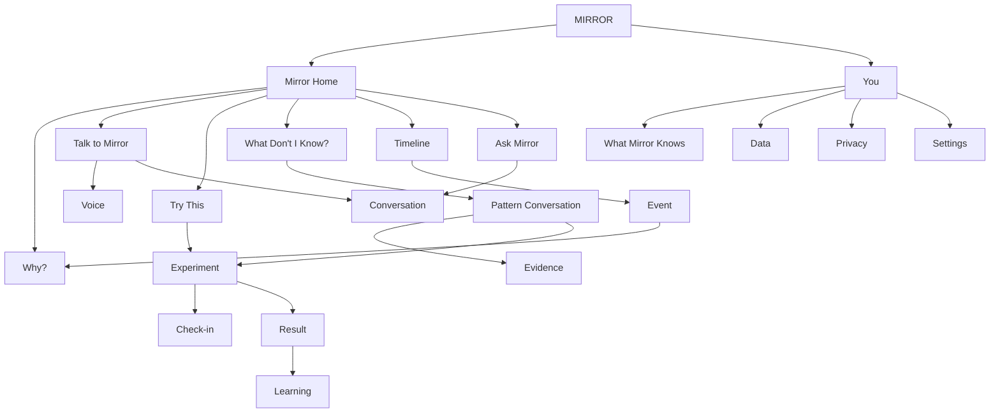

Haan bhai. **Exactly isi direction mein jaana chahiye.** MIRROR ko SaaS dashboard nahi, **ek conversational personal mirror** banana hai.

Matlab user ko alag-alag “Insight / Pattern / Evidence / Experiment” screens mein ghumaana nahi hai. **Mostly sab kuch Mirror screen ke andar conversation + cards + bottom sheets ke through hoga.**

Neeche sirf screens aur unmein kya hoga:

---

# MIRROR — SCREEN LIST

## 1. Splash Screen

```text
MIRROR

Understand your patterns.
Test what changes them.
```

* Logo
* Minimal animation
* No buttons

---

## 2. Welcome Screen

```text
Meet your Mirror.

You live your life.
I’ll pay attention to the patterns.

[ Get Started ]
```

* Short intro
* Privacy reassurance
* Get Started

---

## 3. Personalize MIRROR

```text
What would you like
to understand better?

[ My focus ]
[ My time ]
[ My habits ]
[ My decisions ]
[ My work ]
[ Something else ]

[ Continue ]
```

* Tap-based choices
* No typing required unless “Something else”

---

## 4. Permission Introduction

```text
The more I can see,
the better I can understand you.

You choose what I can access.

[ Continue ]

Later:
[ I'll do this later ]
```

Then individual native permission prompts only when relevant.

---

# MAIN APP

## 5. MIRROR — Main Screen ⭐

**This is the primary screen of the whole app.**

```text
Good evening

I noticed something.

┌──────────────────────────────┐
│                              │
│  YOU DON'T HAVE A            │
│  TIME PROBLEM.               │
│                              │
│  You have a switching        │
│  problem.                    │
│                              │
│  38 switches this week       │
│                              │
│      [ See why → ]           │
└──────────────────────────────┘

Something worth testing

Protect your first 60 minutes
tomorrow.

[ Try it ]

──────────────────────────────

How was today?

😊 Good   😐 Okay   😵 Chaos

──────────────────────────────

             🎙
        Talk to Mirror
```

This single screen contains:

* Important observation
* “Why?” entry
* Experiment suggestion
* tiny daily reflection
* conversational entry point

---

# 6. MIRROR Conversation

Tap **Talk to Mirror**.

```text
Mirror

          What’s on your mind?

You:
"I couldn't focus today."

────────────────────────

Mirror:

I noticed something similar
last Thursday.

You had 4 interruptions
before your first focused session.

Do you think that's what
happened today too?

[ Yes ]
[ Maybe ]
[ No ]
```

Then conversation continues naturally.

No separate forms.

---

# 7. Voice Conversation

```text
Mirror

I'm listening...

          ◉

"Tell me what happened."

────────────────

        [ Stop ]

```

After recording:

```text
I heard:

"Today was chaotic because
I had too many meetings."

Did I get that right?

[ Yes ]
[ Fix ]
```

---

# 8. “Why?” View

Not a full new dashboard.

Open as **bottom sheet** over Mirror.

```text
Why do I think this?

────────────────────────

I noticed:

38 app switches
this week

You also had:

6 unfinished sessions

And this happened on
7 of your last 10 workdays.

────────────────────────

So I think:

Frequent switching may be
making it harder to stay in
one task.

Confidence

82%

[ That's right ]

[ Not really ]
```

---

# 9. “What Do You Mean?” Conversation

User:

> Why do I keep switching?

Mirror:

```text
You usually switch when
your next step isn't clear.

That happened 6 times recently.

Want to see an example?

[ Show me ]
```

Then:

```text
Monday

You started:
"Build onboarding"

12 min later:
Slack

9 min later:
Browser

15 min later:
YouTube

Then you stopped.

That's why I flagged it.
```

The user explores through conversation.

---

# 10. Experiment Suggestion

Opened from **Try it**.

```text
I think this is worth testing.

For the next 7 days:

Before starting work,
decide the ONE next action.

That's it.

I'll watch what changes.

[ Start experiment ]

[ Not now ]
```

---

# 11. Experiment Confirmation

```text
Let's keep it simple.

Experiment

ONE NEXT ACTION

Duration
7 days

I'll watch:

Focus time
Task switching
Completion

You don't need to track
anything manually.

[ Start ]
```

This is important:

### MIRROR tracks the experiment for the user.

---

# 12. Experiment Running

Still conversational.

```text
Good morning.

Day 4 of your experiment.

Something interesting happened.

Your uninterrupted focus:

23m → 36m

That's +57%.

Your app switching is also down.

Want to know what's happening?

[ Show me ]

[ Keep going ]
```

---

# 13. Experiment Check-in

Instead of a form:

```text
Quick check-in.

How did that feel today?

😊 Better
😐 Same
😵 Worse
```

That's basically it.

Optional voice:

```text
🎙 Tell me more
```

---

# 14. Experiment Result

```text
Your experiment is complete.

And... it worked.

────────────────────────

Focus

23m → 36m

+57%

Switching

4.8 → 3.1

-35%

────────────────────────

I think defining the next
action helps you stay focused.

Confidence: 91%

[ Keep this learning ]

[ Tell me more ]
```

---

# 15. New Learning Conversation

Tap **Keep this learning**:

```text
I'll remember this.

You seem to work better when
your next action is clear.

I'll use this when I notice
similar situations.

[ Got it ]
```

No “Create Pattern” button.

**User doesn't need to know our internal terminology.**

---

# 16. Daily Mirror

User opens app after a day:

```text
Your day, in a minute.

You had:

2h 14m focused work
3 meetings
31 app switches

But something changed.

Your longest focus session
was 72 minutes.

That's unusually high for you.

[ Why? ]
```

---

# 17. “What Changed?”

```text
I compared today
with your usual days.

Today:

72m focus

Usually:

38m

The biggest difference?

You had no meetings
between 9 and 11.

Interesting.

[ Try protecting this time ]
```

---

# 18. “What Don't I Know About Myself?” ⭐

This should be directly accessible from Mirror.

```text
Want me to look deeper?

I found 3 things
you haven't noticed yet.

────────────────

1.

You tend to lose momentum
after scope changes.

86%

[ Tell me more ]

────────────────

2.

Your best work follows
a similar morning routine.

81%

[ Tell me more ]

────────────────

3.

Switching tasks costs you
more than you think.

74%

[ Explore ]
```

Everything opens conversationally.

---

# 19. Personal Pattern Conversation

Instead of a “Pattern Detail” screen:

```text
Mirror

I've noticed you often
lose momentum after scope
changes.

Want to know why?

[ Yes ]
```

Then:

```text
I found this 8 times.

Projects that changed scope:

8

Projects you stopped
working on afterward:

6

That's a pretty strong pattern.

But it's still only an
observation—not a fact.

[ Test it ]
[ I don't think so ]
```

---

# 20. Contradiction Conversation

```text
Something doesn't quite match.

You often say:

"I don't have enough time."

But over the last 2 weeks:

Free time       18h
Focused work     7h
Context switching 11h

So maybe time itself
isn't your biggest problem.

Want to investigate?

[ Yes ]
[ Not really ]
```

---

# 21. Decision Conversation

User:

```text
I have to decide whether
to continue this project.
```

Mirror:

```text
Okay.

What matters most here?

[ Money ]
[ Learning ]
[ Time ]
[ Growth ]
[ Peace of mind ]

```

Then MIRROR asks only what it needs.

No giant decision form.

---

# 22. Decision Review

Weeks later:

```text
You made this decision
6 weeks ago.

You expected:

Learning     High
Revenue      Medium
Time cost    Low

Here's what actually happened.

Learning     High ✓
Revenue      Low  ✕
Time cost    High ✕

Would you like me to
remember this pattern?

[ Yes ]
[ No ]
```

---

# 23. Timeline

Even Timeline stays minimal.

```text
Today

9:04   Started work
9:52   Deep focus
10:01  Slack
10:07  Coding
10:39  Meeting
11:44  Focus
13:10  Break
15:30  Project work

────────────────

Mirror noticed:

Your strongest focus
was before the meeting.

[ Ask why ]
```

Timeline isn't a spreadsheet.

It's **a story of what happened**.

---

# 24. Search / Ask Mirror

Instead of conventional search:

```text
┌──────────────────────────┐
│ 🔍 Ask anything...       │
└──────────────────────────┘

Try:

"Why am I not finishing things?"

"What changed this month?"

"When am I most focused?"

"What keeps distracting me?"
```

Search = **conversation**.

---

# 25. You

Keep this extremely small.

```text
You

────────────────

Things Mirror knows

24 patterns
8 experiments
17 learnings

[ Explore ]

────────────────

Your data

Connected sources
Permissions
Privacy

────────────────

Account

Subscription
Notifications
Settings
```

---

# 26. “Things Mirror Knows”

```text
Things I've learned about you.

FOCUS

You work best when your
next step is clear.

91%

────────────────

TIME

Your mornings are more
productive than evenings.

84%

────────────────

DECISIONS

You reconsider uncertain
decisions more often.

76%
```

Again: tap → conversation.

---

# 27. Privacy

```text
Your Mirror is yours.

You control:

What I can access
What I remember
What I forget

────────────────

[ Connected data ]

[ What AI can see ]

[ Delete my data ]

[ Export my data ]

[ Delete account ]
```

---

# 28. Connected Data

```text
What can I see?

✓ Reflections

✓ Experiments

○ Calendar

○ App activity

○ GitHub

○ Other sources
```

Each source has:

```text
Why I need this
What I use
What I don't use
```

---

# 29. Notifications

```text
Mirror notifications

[✓] Important discoveries

[✓] Experiment updates

[✓] Experiment results

[ ] Daily reflection

[ ] Weekly summary
```

Very restrained.

---

# 30. Subscription

Keep it conversational too.

```text
You've discovered
7 things about yourself.

There's more to your Mirror.

PRO includes:

Unlimited history
Advanced patterns
Unlimited experiments
Deeper questions
Personal predictions
Connected sources

[ Start free trial ]

Maybe later
```

---

# 31. Account Settings

```text
Settings

Notifications
Privacy
Connected data
Security
Appearance
Subscription
Help
About

Delete account
Log out
```

---

# Bottom Navigation

I agree with your idea that this should **NOT feel like SaaS**.

So I'd make navigation only:

```text
┌─────────────────────────────────┐
│                                 │
│          Current content        │
│                                 │
│                                 │
│                                 │
├─────────────────────────────────┤
│   Mirror   Timeline   You       │
└─────────────────────────────────┘
```

And:

### **Experiments should NOT be a permanent bottom tab.**

Why?

Because then MIRROR starts looking like:

> Dashboard → Timeline → Experiments → Profile

which is SaaS/productivity-app territory.

Instead:

```text
Mirror
  ↓
"I noticed something."
  ↓
"Want to test it?"
  ↓
Experiment
```

Experiments **emerge from the conversation**.

That's much more natural.

---

# Final App Structure



# The rule for the entire app

**Every screen should feel like MIRROR is talking to you.**

Not:

> “Pattern Management”

but:

> **“I noticed something.”**

Not:

> “Evidence Analysis”

but:

> **“Here's why I think that.”**

Not:

> “Experiment Configuration”

but:

> **“Want to test this?”**

Not:

> “Experiment Results”

but:

> **“And... it worked.”**

Not:

> “Personal Behavioral Model”

but:

> **“Things I've learned about you.”**

That's the direction I would lock. **MIRROR should feel like one intelligent place where a conversation unfolds—not a collection of 30 SaaS screens.**
