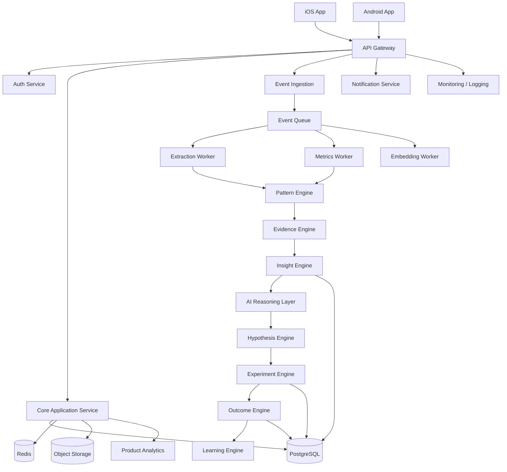
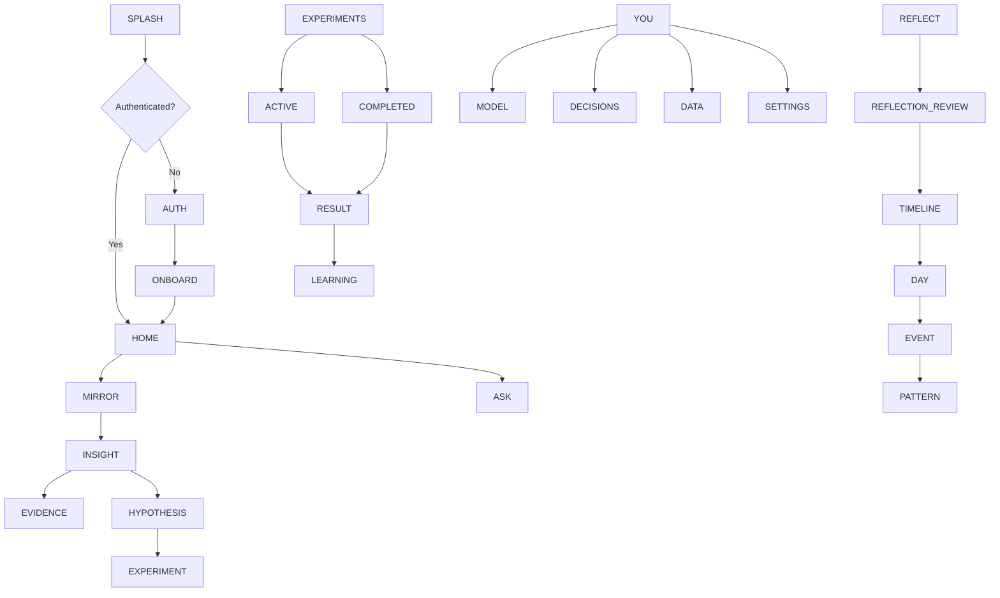
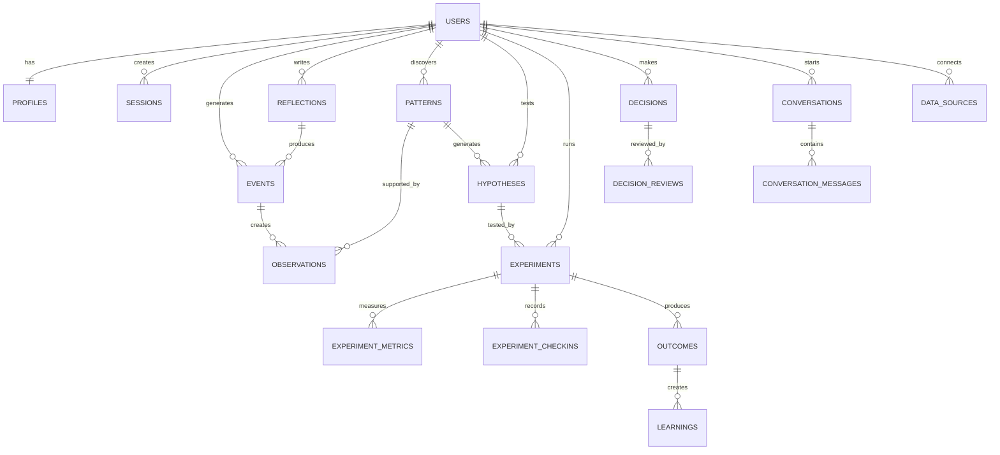
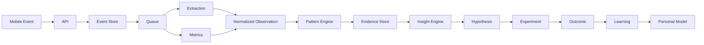
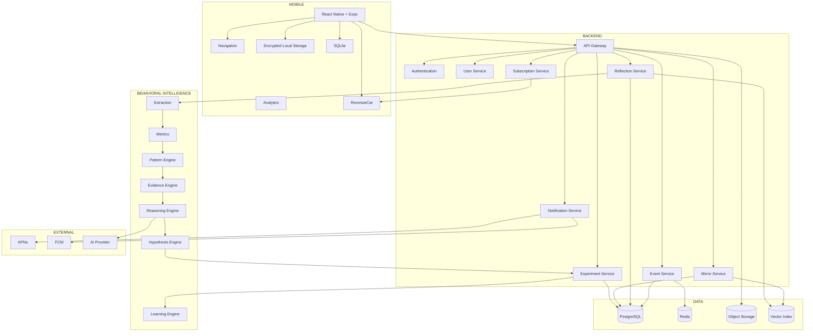

Yes. I’m going to lock the product decisions rather than keep this in question mode.

I’m treating **MIRROR as a production-grade iOS + Android consumer app**, with the **Personal Behavioral Laboratory / N-of-1 experimentation** concept as the core differentiator.

One current Shipaton constraint is especially important: standard entries need a new mobile app released during the Aug. 1–Sep. 30, 2026 window, RevenueCat powering at least one purchase or RevenueCat Ads, and a live supported-store listing available in the US. The submission also requires a public demo video, icon, screenshot, RevenueCat project ID, and premium-access mechanism for judges. ([RevenueCat][1])

# MIRROR

## Production Mobile Product & Technical Blueprint

### Product thesis

> **MIRROR helps you discover behavioral patterns, turn them into testable hypotheses, and learn what actually changes your outcomes.**

Not:

* another habit tracker
* another journal
* another AI chatbot
* another task manager
* another screen-time dashboard
* another generic “AI life coach”

The fundamental product object is a **behavioral hypothesis**.

```text
        REAL LIFE
           ↓
        SIGNALS
           ↓
       OBSERVATIONS
           ↓
        PATTERNS
           ↓
      HYPOTHESES
           ↓
       EXPERIMENTS
           ↓
        OUTCOMES
           ↓
       LEARNINGS
           ↓
     BETTER HYPOTHESES
```

---

# 1. Product Overview

## Product name

**MIRROR**

## Primary tagline

**Understand your patterns. Test what changes them.**

## Secondary positioning

**A personal behavioral laboratory.**

## Core promise

MIRROR doesn't tell users what kind of person they should become.

It helps them understand:

* what they actually do
* what patterns repeat
* where their assumptions conflict with evidence
* what might be causing those patterns
* what intervention could change them
* whether that intervention actually worked

---

# 2. Target User

## Primary

**Knowledge workers and ambitious individuals aged roughly 18–40.**

Examples:

* developers
* designers
* founders
* students
* creators
* freelancers
* professionals
* researchers

The shared characteristic isn't their job.

It's this:

> **“I know what I want to do, but I don't fully understand why my behavior keeps getting in the way.”**

## Secondary

* productivity-focused users
* self-improvement users
* people running personal experiments
* people interested in quantified-self concepts

---

# 3. Core Problem

Existing products generally answer one of these:

**What should I do?**

or

**What did I do?**

MIRROR answers:

> **“What does my behavior suggest about how I actually work—and what happens if I change something?”**

That's the gap.

---

# 4. Core Value Proposition

### Traditional productivity app

```text
Goal
 ↓
Task
 ↓
Completion
```

### MIRROR

```text
Behavior
 ↓
Pattern
 ↓
Hypothesis
 ↓
Experiment
 ↓
Evidence
 ↓
Personal learning
```

The second loop gets more valuable over time.

---

# 5. Product Principles

These are architectural requirements, not marketing language.

### Principle 1 — Evidence before insight

Never generate:

> “You're bad at finishing things.”

Generate:

> “7 of your last 10 projects changed scope before completion.”

---

### Principle 2 — Uncertainty must be visible

Every inferred pattern has:

* confidence
* evidence
* timeframe
* source
* alternative explanation

---

### Principle 3 — Correlation isn't causation

MIRROR should say:

> “These behaviors appear associated.”

Not:

> “This behavior caused your result.”

Experiments provide stronger evidence.

---

### Principle 4 — AI never becomes the source of truth

The system of record is:

**structured data + deterministic analysis + statistical analysis.**

LLMs interpret and explain.

---

### Principle 5 — User controls the model

Every major pattern can be:

* Confirmed
* Rejected
* Corrected
* Investigated
* Tested

---

### Principle 6 — Privacy by design

MIRROR potentially contains extremely intimate information.

Therefore:

**data minimization + encryption + explicit consent + deletion + source controls** are foundational.

---

# 6. MVP Scope

## P0 — Must have

### Identity

* Apple Sign In
* Google Sign In
* email magic link
* account recovery
* session management

### Reflection

* text reflection
* voice reflection
* transcription
* structured extraction
* edit extracted information

### Behavioral timeline

* events
* reflections
* activities
* focus sessions
* experiment events

### Pattern engine

* frequency patterns
* duration patterns
* temporal patterns
* behavioral correlations
* anomaly detection
* trend detection

### Evidence system

* evidence list
* confidence
* source
* timeframe
* raw-event traceability

### Hypothesis system

* generated hypotheses
* user confirmation
* rejection
* correction

### Experiments

* experiment proposal
* baseline
* intervention
* duration
* metrics
* progress
* result
* learning

### Ask MIRROR

Natural-language questions over personal data.

### Personal model

* patterns
* behaviors
* experiments
* learnings

### Notifications

Only meaningful events.

### RevenueCat

* subscription
* entitlement
* trial
* premium access

RevenueCat's SDK should be initialized with only the public platform SDK key in the client; secret keys remain server-side. ([RevenueCat][2])

---

# 7. Explicitly NOT in MVP

Don't destroy the first version with feature creep.

### P2

* Gmail analysis
* Slack analysis
* Notion integration
* GitHub integration
* wearable integrations
* health data
* social network
* community
* AI avatar
* personality tests
* marketplace
* desktop app
* web dashboard
* team analytics
* workplace monitoring
* relationship analysis

The first version needs to prove:

> **Pattern → Experiment → Measurable Learning.**

---

# 8. Platform Strategy

## Target

### iOS + Android

This is a consumer product, and the behavioral-data surface becomes much more valuable when the product isn't restricted to one ecosystem.

For Shipaton specifically, both iOS and Android are eligible mobile targets. ([RevenueCat][1])

---

# 9. Recommended Technology

## Primary recommendation

### React Native + Expo development platform

with native modules where required.

Why:

| Factor            | React Native |
| ----------------- | ------------ |
| Development speed | Excellent    |
| iOS + Android     | Excellent    |
| UI quality        | Excellent    |
| TypeScript        | Excellent    |
| Backend sharing   | Excellent    |
| Maintainability   | Excellent    |
| Ecosystem         | Excellent    |
| Native APIs       | Strong       |
| Cost              | Low          |
| Team requirement  | Small        |
| Animations        | Strong       |

### Why not Flutter?

Excellent option, but your existing React/TypeScript experience makes React Native substantially more efficient.

### Why not native?

Native Swift + Kotlin would maximize platform-specific control but doubles the primary application implementation.

### Why not KMP?

Interesting for shared business logic, but MIRROR's first challenge isn't business-logic portability. It's getting the behavioral UX right.

### Final decision

**React Native + Expo + TypeScript**

with:

* React Navigation
* Zustand
* TanStack Query
* SQLite/local persistence
* Reanimated
* native modules where necessary

---

# 10. High-Level Architecture



---

# 11. Mobile Navigation



---

# 12. Root Navigation

Four primary destinations:

```text
┌────────────────────────────────────┐
│                                    │
│             Content                │
│                                    │
│                                    │
├────────────────────────────────────┤
│  Mirror  Timeline  Experiments  You│
└────────────────────────────────────┘
```

Floating action:

**Reflect**

It should not become a fifth navigation destination.

---

# 13. Screen Inventory

## Authentication

1. Splash
2. Welcome
3. Sign in
4. Apple authentication
5. Google authentication
6. Email magic link
7. Authentication verification
8. Account recovery
9. Session expired

---

## Onboarding

10. Welcome to MIRROR
11. Goal selection
12. First reflection
13. Permission introduction
14. Baseline generation
15. First insight
16. Notification permission
17. Completion

---

## Mirror

18. Mirror Home
19. Insight Detail
20. Evidence View
21. Pattern Detail
22. Hypotheses
23. Contradictions
24. Ask MIRROR
25. Ask MIRROR response
26. What Don't I Know?

---

## Timeline

27. Timeline
28. Day View
29. Event Detail
30. Activity Detail
31. Timeline Filter

---

## Reflection

32. Reflect
33. Voice Recording
34. Processing
35. Extraction Review
36. Edit Reflection
37. Saved Reflection

---

## Experiments

38. Experiments Home
39. Experiment Proposal
40. Experiment Setup
41. Baseline
42. Active Experiment
43. Daily Check-in
44. Experiment Result
45. Learning
46. Experiment History

---

## Personal Model

47. You
48. Personal Model
49. Patterns Library
50. Pattern Detail
51. Decisions
52. Decision Creation
53. Decision Review
54. Learnings

---

## Data

55. Data Sources
56. Permission Manager
57. Connected Source
58. Data Usage Explanation

---

## Account

59. Profile
60. Subscription
61. RevenueCat Customer Center
62. Notifications
63. Privacy
64. Security
65. Export Data
66. Delete Account
67. About
68. Logout confirmation

That's approximately **68 production screens/states**, although several can be implemented as variants of the same screen rather than 68 independent components.

---

# 14. Mirror Home Layout

```text
┌──────────────────────────────┐
│ Good morning                 │
│ Here's what changed.         │
│                              │
│ ┌──────────────────────────┐ │
│ │ YOUR PATTERN             │ │
│ │                          │ │
│ │ You protect your         │ │
│ │ mornings better than     │ │
│ │ evenings.                │ │
│ │                          │ │
│ │ Confidence 87%           │ │
│ │                          │ │
│ │ [See evidence]           │ │
│ └──────────────────────────┘ │
│                              │
│ SOMETHING CHANGED            │
│                              │
│ Focus                         │
│ 41m ─────────→ 54m           │
│ +32%                          │
│                              │
│ ┌──────────────────────────┐ │
│ │ WORTH TESTING            │ │
│ │                          │ │
│ │ Context switching may    │ │
│ │ be hurting completion.   │ │
│ │                          │ │
│ │ [Run experiment]         │ │
│ └──────────────────────────┘ │
│                              │
│        Ask Mirror            │
│                              │
│  Mirror Timeline Experiments You
└──────────────────────────────┘
```

---

# 15. Design System

## Visual direction

Think:

**Apple Health × research instrument × premium journal**

Not:

* gamified productivity
* neon AI
* dashboard overload
* generic purple-gradient AI app

---

## Colors

### Background

`#F7F8F7`

### Surface

`#FFFFFF`

### Primary

Deep graphite:

`#17201D`

### Secondary

Muted green:

`#54766B`

### Accent

Soft emerald:

`#79A997`

### Accent light

`#DDEBE5`

### Text

Primary:

`#17201D`

Secondary:

`#65716C`

Muted:

`#8E9994`

### Success

`#3F8065`

### Warning

`#A7793D`

### Error

`#B85C5C`

---

# 16. Typography

Use **SF Pro** on iOS and a compatible system font on Android.

Hierarchy:

```text
Display      34 / 40
H1           28 / 34
H2           22 / 28
H3           18 / 24
Body         16 / 24
Body Small   14 / 20
Caption      12 / 16
```

Large whitespace.

Short paragraphs.

Numbers should be visually strong.

---

# 17. Component System

Reusable components:

```text
MirrorCard
InsightCard
EvidenceCard
PatternCard
HypothesisCard
ExperimentCard
MetricCard
TimelineEvent
TimelineSection
ConfidenceBadge
SourceBadge
StatRow
TrendIndicator
ReflectionComposer
VoiceButton
PrimaryButton
SecondaryButton
DestructiveButton
TextInput
SearchInput
BottomSheet
ConfirmationDialog
EmptyState
ErrorState
Skeleton
Toast
ProgressRing
ProgressBar
Chart
NavigationBar
TopBar
Avatar
Tag
```

---

# 18. Touch & Interaction

Minimum touch target:

**44 × 44 pt**

Use:

* swipe back
* pull to refresh where appropriate
* bottom sheets
* native navigation gestures
* long press only for contextual actions
* haptics for meaningful state changes

Avoid:

* excessive swipe-only interactions
* hidden actions
* tiny controls
* gesture-dependent primary functionality

---

# 19. Animation

Animation should explain data transformation.

### Pattern animation

```text
Events
 ↓
multiple dots
 ↓
cluster
 ↓
pattern
```

### Experiment

```text
Baseline ──────────────┐
                       ↓
                  Intervention
                       ↓
After ─────────────────┘
```

### Insight reveal

Evidence appears first.

Interpretation appears second.

Confidence appears last.

This visually reinforces:

> **Evidence → interpretation**

---

# 20. Device Capabilities

## Microphone

**Required for voice reflection.**

Request only when user taps voice reflection.

If denied:

> Text reflection remains fully available.

---

## Notifications

Used for:

* experiment check-ins
* meaningful discoveries
* experiment completion
* significant behavioral changes

Ask after user understands the value.

---

## Calendar

**Not MVP.**

Future optional integration.

---

## Screen/app usage

Potentially valuable but platform-dependent.

This requires platform-specific implementation and careful consent.

### Android

Potentially use UsageStats-related APIs where appropriate.

### iOS

iOS has significantly tighter restrictions around application/device activity data.

Therefore this must be validated against the exact APIs and App Store policy before making it a foundational dependency.

**Architecture must not depend on this data existing.**

---

## Health

Not MVP.

---

## Contacts

No.

---

## Location

No.

---

## Bluetooth/NFC

No.

---

## Camera

No.

---

# 21. Offline Strategy

MIRROR should be **offline-capable**, but not fully offline-first.

### Offline capabilities

Users can:

* read cached insights
* view timeline
* create reflections
* record voice
* view active experiments
* perform check-ins

Queued actions:

```text
Local Action
     ↓
SQLite Queue
     ↓
Network Available
     ↓
Sync
     ↓
Server Confirmation
```

---

# 22. Local Database

Use SQLite.

Recommended:

**Drizzle ORM or a lightweight SQLite abstraction appropriate for React Native.**

Tables:

```text
local_events
local_reflections
local_experiments
local_sync_queue
local_cache_metadata
```

Sensitive local data should be encrypted where appropriate.

---

# 23. Sync Strategy

Every mutation receives:

```text
clientMutationId
```

Server enforces idempotency.

Example:

```http
POST /v1/reflections
Idempotency-Key: 8b7f...
```

If the request is accidentally repeated, the backend returns the original result instead of creating duplicates.

---

# 24. Backend

## Recommended stack

### Runtime

**Node.js + TypeScript**

### Framework

**NestJS**

### Database

**PostgreSQL**

### Cache

**Redis**

### Queue

**BullMQ / Redis**

### Storage

**S3-compatible object storage**

### API

**REST**

### AI

Provider abstraction layer.

---

# 25. AI Architecture

Do not have one gigantic prompt.

Separate responsibilities.

```text
                    AI LAYER

          ┌──────────┴──────────┐
          │                     │
      Extraction            Reasoning
          │                     │
          ↓                     ↓
    Structured Data        Hypotheses
          │                     │
          └──────────┬──────────┘
                     ↓
               Explanation
```

### Services

`ExtractionService`

Converts:

> “I spent the whole afternoon jumping between Slack and code.”

into:

```json
{
  "activities": [
    "Slack",
    "coding"
  ],
  "possible_pattern": "context_switching",
  "confidence": 0.78
}
```

But this is **candidate data**, not truth.

---

# 26. Pattern Engine

Use deterministic/statistical logic first.

### Pattern types

```text
Frequency
Duration
Trend
Sequence
Temporal
Correlation
Deviation
Clustering
Recurrence
Completion
Behavioral mismatch
```

Example:

```text
Observed:

10 projects

8 changed scope

6 abandoned after scope change

Potential pattern:

Scope changes correlate
with project abandonment.
```

---

# 27. Evidence Model

Every insight stores:

```text
source
event IDs
time range
calculation
confidence
model version
generated timestamp
```

Example:

```json
{
  "confidence": 0.82,
  "evidenceCount": 8,
  "timeRange": {
    "from": "...",
    "to": "..."
  },
  "sources": [
    "reflection",
    "focus_session"
  ],
  "modelVersion": "pattern-v1.2"
}
```

This gives us reproducibility.

---

# 28. Database Model

Core entities:

```text
users
profiles
sessions
events
event_sources
reflections
observations
patterns
hypotheses
experiments
experiment_metrics
experiment_checkins
outcomes
learnings
decisions
decision_reviews
conversations
conversation_messages
notifications
notification_preferences
subscriptions
permissions
data_sources
audit_logs
```

---

# 29. ER Diagram



---

# 30. Important Database Tables

## users

```text
id UUID PK
email
status
created_at
updated_at
deleted_at
```

Indexes:

```text
email UNIQUE
status
deleted_at
```

---

## events

```text
id UUID PK
user_id UUID FK
type
source
occurred_at
duration_seconds
metadata JSONB
confidence DECIMAL
created_at
```

Indexes:

```text
(user_id, occurred_at)
(user_id, type, occurred_at)
```

---

## patterns

```text
id UUID PK
user_id UUID FK
category
title
description
confidence
status
first_observed_at
last_observed_at
model_version
created_at
updated_at
```

---

## hypotheses

```text
id UUID PK
user_id UUID FK
pattern_id UUID FK
statement
confidence
status
user_confirmed
user_rejected
created_at
```

---

## experiments

```text
id UUID PK
user_id UUID FK
hypothesis_id UUID FK
title
intervention
duration_days
status
started_at
ended_at
created_at
```

---

## experiment_metrics

```text
id UUID PK
experiment_id UUID FK
name
unit
baseline_value
target_value
current_value
final_value
created_at
```

---

# 31. API Architecture

Base:

```text
/api/v1
```

Authentication:

```text
Authorization: Bearer <access_token>
```

---

# 32. Authentication API

```http
POST /auth/apple
POST /auth/google
POST /auth/magic-link
POST /auth/refresh
POST /auth/logout
DELETE /auth/account
```

---

# 33. User API

```http
GET    /me
PATCH  /me
GET    /me/preferences
PATCH  /me/preferences
```

---

# 34. Reflection API

```http
POST   /reflections
GET    /reflections
GET    /reflections/:id
PATCH  /reflections/:id
DELETE /reflections/:id
POST   /reflections/:id/process
```

Pagination:

```text
cursor-based
```

Not offset pagination.

---

# 35. Timeline API

```http
GET /timeline
GET /timeline/:date
GET /events/:id
```

Example:

```http
GET /timeline?from=2026-09-01&to=2026-09-07&cursor=...
```

Return only required fields.

---

# 36. Pattern API

```http
GET   /patterns
GET   /patterns/:id
POST  /patterns/:id/confirm
POST  /patterns/:id/reject
POST  /patterns/:id/correct
```

---

# 37. Hypothesis API

```http
GET  /hypotheses
GET  /hypotheses/:id
POST /hypotheses/:id/confirm
POST /hypotheses/:id/reject
```

---

# 38. Experiment API

```http
GET    /experiments
POST   /experiments
GET    /experiments/:id
PATCH  /experiments/:id
POST   /experiments/:id/start
POST   /experiments/:id/checkins
POST   /experiments/:id/complete
GET    /experiments/:id/results
```

---

# 39. Ask MIRROR API

```http
POST /mirror/questions
```

Request:

```json
{
  "question": "Why am I not finishing my projects?"
}
```

Response:

```json
{
  "answer": "...",
  "confidence": 0.82,
  "evidence": [],
  "patterns": [],
  "suggestedExperiment": {}
}
```

Never return an unsupported absolute conclusion.

---

# 40. API Error Format

Standard:

```json
{
  "error": {
    "code": "VALIDATION_ERROR",
    "message": "Invalid reflection",
    "details": {},
    "requestId": "..."
  }
}
```

Error categories:

```text
AUTH_REQUIRED
FORBIDDEN
VALIDATION_ERROR
NOT_FOUND
CONFLICT
RATE_LIMITED
SERVICE_UNAVAILABLE
AI_UNAVAILABLE
SYNC_CONFLICT
INTERNAL_ERROR
```

---

# 41. Rate Limits

Example initial limits:

```text
Authentication
10 requests / minute / IP

Reflection processing
20 / hour / user

AI questions
30 / hour / user

General API
120 / minute / user
```

These should be configurable server-side.

---

# 42. Authentication Architecture

### Access token

Short-lived:

**15 minutes**

### Refresh token

Long-lived:

approximately **30 days**, with rotation.

Store refresh tokens securely.

Mobile:

**iOS Keychain / Android Keystore-backed secure storage.**

Never:

```text
AsyncStorage
SharedPreferences plaintext
```

for sensitive tokens.

---

# 43. Biometric Login

Optional.

Biometrics don't replace the server session.

Instead:

```text
App locked
 ↓
Face ID / fingerprint
 ↓
Unlock local session
```

If refresh session expires:

→ normal authentication required.

---

# 44. Security Architecture

### Encryption

Transit:

**TLS 1.2+**

At rest:

database/storage encryption provided by infrastructure.

### Sensitive fields

Consider application-level encryption for especially sensitive user content.

### Secrets

Never in app:

```text
AI provider secret
Database password
JWT signing secret
RevenueCat secret API key
S3 secret
```

Only public mobile SDK keys may be shipped to the client. RevenueCat specifically distinguishes public SDK keys from secret server-side keys. ([RevenueCat][3])

---

# 45. AI Security

User input is untrusted.

Treat:

```text
reflection
email
imported text
AI output
```

as untrusted data.

Protect against:

* prompt injection
* malicious embedded instructions
* data exfiltration
* oversized input
* model hallucination
* cross-user retrieval

Every retrieval query must be scoped by:

```text
user_id
```

at the database layer.

Not merely application logic.

---

# 46. Privacy Architecture

Each piece of data gets:

```text
source
purpose
retention
user permission
```

Users can:

* delete reflection
* delete event
* disconnect source
* export data
* delete account

Account deletion should trigger an asynchronous deletion workflow.

---

# 47. Push Notifications

Notification types:

### Experiment

> “Day 4: your experiment is halfway complete.”

### Discovery

> “Something changed this week.”

### Completion

> “Your experiment is complete.”

### Insight

> “MIRROR found a new pattern.”

### Reflection

Optional user-configured reminder.

No:

> “You haven't opened MIRROR today 😢”

That's engagement bait and weakens the product.

---

# 48. Notification Architecture

```text
Event
 ↓
Rule Engine
 ↓
Notification Eligibility
 ↓
Preference Check
 ↓
Rate Limit
 ↓
Push Provider
 ↓
APNs / FCM
```

Deep link:

```text
mirror://experiment/{id}
mirror://pattern/{id}
mirror://insight/{id}
mirror://reflection/{id}
```

---

# 49. Deep Linking

### iOS

Universal Links.

### Android

Android App Links.

Routes:

```text
/mirror
/pattern/:id
/experiment/:id
/experiment/:id/result
/reflection/:id
/settings/subscription
```

Unauthenticated user:

```text
Deep link
 ↓
Authentication
 ↓
Original destination
```

---

# 50. Offline Error UX

Never show:

> “Network error.”

Instead:

> **Saved on this device.**

> We'll sync it when you're back online.

For failed sync:

> **Couldn't sync yet.**

`[Retry]`

---

# 51. Loading UX

Avoid blank screens.

Use skeletons:

```text
InsightCardSkeleton
TimelineSkeleton
ExperimentSkeleton
```

For AI processing:

```text
Reading your reflection...
Finding useful signals...
Checking against your history...
```

But don't fake specific processing steps if the backend isn't actually doing them.

---

# 52. Empty States

### No patterns

> **Your Mirror is still learning.**

> Keep reflecting and MIRROR will look for repeated patterns.

### No experiments

> **Nothing to test yet.**

> When MIRROR finds a strong enough hypothesis, you'll see it here.

### No timeline

> **Your story starts here.**

---

# 53. Accessibility

Required:

* Dynamic Type
* VoiceOver
* TalkBack
* semantic labels
* minimum touch targets
* sufficient contrast
* reduced motion
* screen reader ordering
* no color-only status indicators

Charts must have text alternatives.

Example:

> “Focus increased from 23 to 37 minutes, a 61% increase.”

---

# 54. Performance Targets

### Cold start

Target:

**< 2.5 seconds** on representative modern devices.

### Screen transition

Target:

**60 FPS**

### API

Typical API:

**p95 < 500 ms**

AI responses:

**stream or progressive loading** where useful.

### Memory

Avoid keeping entire timeline in memory.

Use:

* pagination
* virtualization
* local caching

---

# 55. Battery

Avoid constant background processing.

Don't:

```text
wake app every few minutes
```

Instead use:

* OS-supported background execution
* batched uploads
* scheduled processing
* server-side computation
* push-triggered refresh

---

# 56. Analytics Architecture

Use privacy-conscious product analytics.

Core events:

```text
app_opened
onboarding_started
onboarding_completed
reflection_started
reflection_created
voice_reflection_created
insight_viewed
insight_confirmed
insight_rejected
evidence_viewed
hypothesis_created
hypothesis_confirmed
experiment_created
experiment_started
experiment_checkin
experiment_completed
experiment_result_viewed
learning_saved
mirror_question_asked
subscription_viewed
trial_started
subscription_started
subscription_cancelled
```

---

# 57. Analytics Parameters

Example:

```text
experiment_started
```

Parameters:

```text
experiment_id
hypothesis_category
duration_days
source
```

Avoid:

```text
raw reflection text
raw email
private message contents
```

Analytics should not become a second surveillance system.

---

# 58. RevenueCat Strategy

RevenueCat is the entitlement layer.

### Free

```text
Basic reflections
Basic timeline
Limited patterns
1 active experiment
Limited history
```

### Pro

```text
Unlimited history
Advanced patterns
Unlimited experiments
Advanced Ask MIRROR
Decision analysis
Predictive analysis
Integrations
Personal behavioral model
```

The subscription should unlock **depth**, not basic dignity.

RevenueCat supports SDK-based subscription infrastructure across iOS/Android and provides UI/customer-management capabilities as well. ([RevenueCat][4])

---

# 59. Paywall Strategy

Don't interrupt the first aha.

Ideal flow:

```text
Install
 ↓
Onboarding
 ↓
First insight
 ↓
First experiment
 ↓
Experiment result
 ↓
"Your Mirror can go deeper."
 ↓
Trial
```

This gives the user proof before monetization.

---

# 60. QA Strategy

## Unit tests

Test:

* pattern calculations
* confidence calculations
* experiment metrics
* date calculations
* sync logic
* permission state
* entitlement logic

---

## Integration

Test:

```text
App
 ↓
API
 ↓
Database
```

---

## E2E

Critical flows:

1. New user onboarding
2. Authentication
3. Reflection
4. Voice reflection
5. Pattern confirmation
6. Experiment creation
7. Experiment check-in
8. Experiment completion
9. Subscription
10. Account deletion

---

# 61. Device Matrix

### iOS

Representative:

* small iPhone
* standard iPhone
* large iPhone
* latest supported iOS
* previous major iOS

### Android

Representative:

* Pixel
* Samsung
* low/mid-range Android
* small screen
* large screen

Also test:

* dark mode
* large text
* reduced motion
* low memory

---

# 62. Network Test Matrix

```text
Wi-Fi
5G
4G
3G-like throttling
Offline
Intermittent
High latency
API timeout
Server 500
DNS failure
```

---

# 63. Critical Edge Cases

| Scenario                      | Expected                       |
| ----------------------------- | ------------------------------ |
| App killed during reflection  | Draft restored                 |
| Network lost during upload    | Queue locally                  |
| Duplicate upload              | Idempotency prevents duplicate |
| Token expired                 | Refresh automatically          |
| Refresh fails                 | Re-authenticate                |
| User denies microphone        | Text reflection remains        |
| Notifications denied          | App continues normally         |
| AI unavailable                | Save input, retry later        |
| Pattern insufficient evidence | Don't surface as fact          |
| Experiment interrupted        | Mark partial / allow resume    |
| Device changed                | Cloud data restored            |
| Account deleted               | Deletion workflow begins       |
| Low storage                   | Graceful local-cache cleanup   |
| Server outage                 | Cached experience continues    |
| Slow AI                       | Progressive loading            |
| User rejects insight          | Don't repeatedly surface it    |
| User changes experiment       | Preserve history               |

---

# 64. Repository Structure

```text
mirror/
│
├── apps/
│   └── mobile/
│       ├── app/
│       ├── assets/
│       ├── components/
│       ├── features/
│       │   ├── auth/
│       │   ├── onboarding/
│       │   ├── mirror/
│       │   ├── timeline/
│       │   ├── reflections/
│       │   ├── experiments/
│       │   ├── patterns/
│       │   ├── decisions/
│       │   ├── profile/
│       │   └── settings/
│       │
│       ├── navigation/
│       ├── services/
│       ├── api/
│       ├── storage/
│       ├── notifications/
│       ├── analytics/
│       ├── hooks/
│       ├── state/
│       ├── theme/
│       ├── utils/
│       └── tests/
│
├── packages/
│   ├── types/
│   ├── validation/
│   ├── api-client/
│   └── design-system/
│
├── backend/
│   ├── src/
│   │   ├── auth/
│   │   ├── users/
│   │   ├── events/
│   │   ├── reflections/
│   │   ├── patterns/
│   │   ├── hypotheses/
│   │   ├── experiments/
│   │   ├── decisions/
│   │   ├── mirror/
│   │   ├── notifications/
│   │   ├── subscriptions/
│   │   ├── ai/
│   │   ├── analytics/
│   │   └── workers/
│   │
│   └── tests/
│
├── infrastructure/
│   ├── docker/
│   ├── terraform/
│   └── monitoring/
│
└── docs/
    ├── architecture/
    ├── api/
    ├── privacy/
    └── product/
```

---

# 65. State Management

Use:

### TanStack Query

For:

* server state
* API cache
* synchronization

### Zustand

For:

* UI state
* session state
* local interaction state

Do **not** put the entire server database into Zustand.

---

# 66. Feature Architecture

Each feature owns its own:

```text
screens
components
hooks
api
models
validation
state
tests
```

Example:

```text
features/experiments/

ExperimentHome.tsx
ExperimentDetail.tsx
ExperimentResult.tsx

components/
ExperimentCard.tsx
MetricChart.tsx
CheckInCard.tsx

api/
experiments.api.ts

hooks/
useExperiment.ts
useExperimentCheckin.ts

models/
experiment.ts

tests/
...
```

This keeps the project maintainable as MIRROR grows.

---

# 67. Backend Event Pipeline



---

# 68. Personal Model

The most important long-term asset.

```text
USER
│
├── GOALS
│
├── PROJECTS
│
├── BEHAVIORS
│
├── DECISIONS
│
├── PATTERNS
│
├── HYPOTHESES
│
├── EXPERIMENTS
│
└── LEARNINGS
```

Eventually:

```text
MIRROR knows:

"What tends to happen?"

"What predicts it?"

"What intervention works?"

"What doesn't?"

"How confident are we?"
```

That becomes the moat.

---

# 69. Signature Feature: What Don't I Know?

This deserves its own experience.

User taps:

**What don't I know about myself?**

Backend:

```text
Find high-confidence patterns
+
patterns not previously surfaced
+
patterns user hasn't rejected
+
patterns with sufficient evidence
```

Result:

```text
I found 3 things
you haven't noticed yet.

01
You tend to lose momentum
after scope changes.

86%

02
Your strongest work sessions
share the same preparation ritual.

81%

03
You underestimate transition
cost between unrelated tasks.

74%
```

This is likely the most memorable MIRROR feature.

---

# 70. Signature Feature: Personal Causal Learning

This is the deeper moat.

MIRROR eventually learns:

```text
Intervention A
      ↓
Outcome +37%

Intervention B
      ↓
Outcome +4%

Intervention C
      ↓
No measurable change
```

Then:

> “Based on your previous experiments, this intervention is more likely to help than the alternatives.”

Not generic advice.

**Personal evidence.**

---

# 71. Development Roadmap

## Phase 0 — Product foundation

### P0

* product specification
* design system
* architecture
* database schema
* API contract
* privacy model
* analytics taxonomy

### Acceptance

Developer can implement without inventing core product rules.

---

# Phase 1 — Mobile foundation

### P0

* Expo project
* navigation
* theme
* authentication
* secure storage
* API client
* error system
* offline database
* analytics

### Acceptance

New user can install → authenticate → reach app.

---

# Phase 2 — Reflection

### P0

* text reflection
* voice recording
* transcription
* extraction
* review
* editing
* persistence

### Acceptance

User can speak naturally and correct the structured interpretation before saving.

---

# Phase 3 — Behavioral model

### P0

* events
* observations
* pattern engine
* evidence
* confidence
* pattern UI

### Acceptance

MIRROR can produce at least one reproducible evidence-backed pattern.

---

# Phase 4 — Ask MIRROR

### P0

* question interface
* retrieval
* evidence ranking
* reasoning
* response generation
* confidence
* evidence presentation

### Acceptance

Every behavioral answer can explain **why MIRROR believes it**.

---

# Phase 5 — Experiments

### P0

* hypothesis
* experiment proposal
* baseline
* intervention
* check-ins
* measurements
* outcome
* learning

### Acceptance

Complete:

```text
Pattern
→ hypothesis
→ experiment
→ outcome
→ learning
```

without manual backend intervention.

---

# Phase 6 — Personal Model

### P1

* model graph
* pattern library
* learnings
* decisions
* contradiction detection

---

# Phase 7 — Monetization

### P0

* RevenueCat
* products
* entitlement
* trial
* paywall
* restore purchases
* subscription management

---

# Phase 8 — Growth

### P1

* share cards
* referral links
* privacy-safe insights
* onboarding optimization
* experiment-based growth loops

---

# Phase 9 — Advanced data

### P2

* calendar
* screen activity
* Gmail
* Slack
* GitHub
* Notion
* wearables

Only add these after the core behavioral loop proves useful.

---

# 72. Acceptance Criteria — Core Product

MIRROR is MVP-complete when:

### Reflection

* User can create reflection.
* User can record voice.
* User can review AI extraction.
* User can correct extraction.
* Data persists offline.
* Data synchronizes when online.

### Pattern

* Pattern engine uses structured evidence.
* Pattern displays confidence.
* Pattern displays source.
* Pattern displays timeframe.
* User can reject pattern.

### Experiment

* User can accept hypothesis.
* User can create experiment.
* Baseline is recorded.
* User can check in.
* Results are calculated.
* Learning is generated.

### Ask MIRROR

* User can ask natural-language questions.
* Answer uses only authorized user data.
* Evidence is displayed.
* Unsupported claims are avoided.

### Privacy

* User can delete content.
* User can export data.
* User can delete account.
* Permissions are explicit.

### Monetization

* RevenueCat entitlement controls premium functionality.
* Restore purchases works.
* Trial works.
* Premium access can be granted to judges.

---

# 73. App Store Risk Areas

For iOS especially, don't make claims around:

* diagnosing mental illness
* treating medical conditions
* medical prediction
* psychological diagnosis

MIRROR should remain a **behavioral/self-reflection product**, not a medical product.

Also, permissions must correspond to clearly explained functionality.

For Shipaton, don't wait until the final week to submit. RevenueCat explicitly warns that store review can take several days and says the app must be fully published for standard entries; TestFlight/testing tracks alone don't satisfy the standard submission requirement. ([RevenueCat][1])

---

# 74. Production Monitoring

Backend:

```text
Sentry
OpenTelemetry
structured logs
metrics
alerts
```

Monitor:

```text
API latency
5xx rate
AI failures
queue depth
database connections
notification failures
subscription webhook failures
sync conflicts
```

---

# 75. Deployment

```text
GitHub
   ↓
CI
   ├── lint
   ├── typecheck
   ├── unit tests
   ├── integration tests
   └── build
          ↓
       staging
          ↓
      E2E tests
          ↓
      production
```

Mobile:

```text
Expo EAS
 ↓
iOS TestFlight / App Store
Android Internal / Production
```

Backend:

```text
Container
 ↓
Cloud deployment
 ↓
PostgreSQL
Redis
Object Storage
```

---

# 76. Environments

Three environments:

```text
development
staging
production
```

Separate:

* databases
* API keys
* AI credentials
* RevenueCat configuration where appropriate
* push credentials
* analytics environments

Never point development at production data.

---

# 77. The First Version We Should Actually Build

If I were acting as the product owner, I'd aggressively constrain V1 to this:

```text
                    MIRROR

                      ↓

                User reflects
                      ↓
                MIRROR observes
                      ↓
               Finds a pattern
                      ↓
             Shows the evidence
                      ↓
             User validates it
                      ↓
              MIRROR proposes
                a hypothesis
                      ↓
               User tests it
                      ↓
                7-day experiment
                      ↓
                Measure result
                      ↓
              Learn what worked
```

That's the product.

Everything else supports that loop.

---

# 78. The 2-Minute Demo Story

Because we're building this for **Shipaton**, the product needs to communicate almost immediately. RevenueCat's current submission guidance explicitly emphasizes a short public demo and tells builders to choose screenshots that tell the product story rather than showing near-identical screens. ([RevenueCat][1])

I'd make the demo:

### 0:00–0:15

User:

> “Why do I keep starting projects but never finishing them?”

MIRROR analyzes their data.

### 0:15–0:35

```text
PATTERN FOUND

8 of your last 10 projects
changed scope before you
stopped working on them.

Confidence: 86%
```

Tap:

**See evidence**

---

### 0:35–0:55

MIRROR:

> “Scope changes appear strongly associated with project abandonment.”

Then:

**Test this hypothesis**

---

### 0:55–1:15

Experiment:

> Define project scope before starting.

7-day experiment.

Beautiful live metric animation.

---

### 1:15–1:35

Result:

```text
PROJECT COMPLETION

41% → 63%

+22%

SCOPE CHANGES
4.1 → 2.0

-51%
```

---

### 1:35–1:50

MIRROR:

> **This intervention appears to work for you.**

> “When starting large projects, defining scope beforehand may improve completion.”

**Save learning**

---

### 1:50–2:00

Final screen:

> **MIRROR doesn't tell you who to become.**

> **It learns what actually changes you.**

That's a much stronger story than showing 15 app screens.

---

# 79. Final Architecture



# 80. The Product Moat

The important part isn't the AI model.

Someone can copy an AI prompt.

Someone can copy a journal.

Someone can copy a habit tracker.

Someone can copy a timeline.

The defensibility comes from the **longitudinal personal experimentation graph**:

```text
                     USER
                       │
             ┌─────────┴─────────┐
             ↓                   ↓
          BEHAVIOR            CONTEXT
             │                   │
             └─────────┬─────────┘
                       ↓
                    PATTERN
                       ↓
                  HYPOTHESIS
                       ↓
                  INTERVENTION
                       ↓
                    RESULT
                       ↓
                   LEARNING
                       ↓
              PERSONAL MODEL
                       │
                       └─────────────┐
                                     ↓
                               NEXT TEST
```

After months, MIRROR doesn't merely know that a user **likes productivity advice**.

It can know something much more valuable:

> **“When you encounter X, you tend to behave like Y. Intervention Z has previously changed that behavior for you with reasonably strong evidence.”**

That is the product I would build.

And importantly, it gives us a clean technical boundary: **MIRROR can start with manual reflections and experiments, then progressively add calendar/device/work integrations without rebuilding the fundamental architecture.**

For the Shipaton build, I'd prioritize **RevenueCat Design Award + Grand Prize growth potential + HAMM**, rather than trying to cram every sponsor category into the app. RevenueCat itself currently positions the Design Award around craft/interaction/animation and the Grand Prize around traction/growth momentum. ([RevenueCat][5])

[1]: https://www.revenuecat.com/blog/engineering/how-to-submit-your-app-for-shipaton?utm_source=chatgpt.com "How to submit your app for Shipaton | RevenueCat"
[2]: https://www.revenuecat.com/docs/getting-started/configuring-sdk?utm_source=chatgpt.com "Configuring the SDK | In-App Subscriptions Made Easy – RevenueCat"
[3]: https://www.revenuecat.com/docs/projects/authentication?utm_source=chatgpt.com "API Keys | In-App Subscriptions Made Easy – RevenueCat"
[4]: https://www.revenuecat.com/docs/getting-started/quickstart?utm_source=chatgpt.com "SDK Quickstart | In-App Subscriptions Made Easy – RevenueCat"
[5]: https://www.revenuecat.com/blog/company/announcing-shipaton-2026?utm_source=chatgpt.com "Announcing Shipaton 2026: Ship an app, win big, join the fun | RevenueCat"
